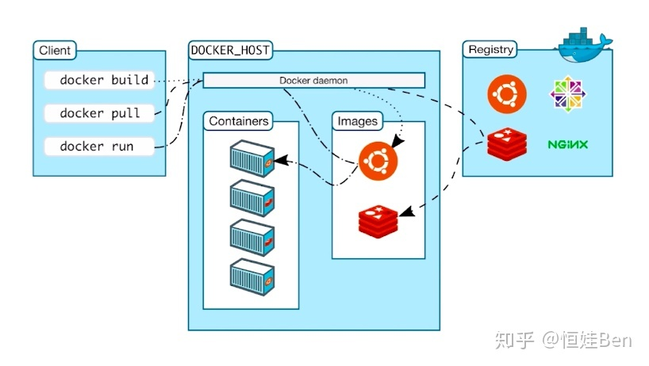

# Docker

通过 Docker 部署完项目后，感受很不错，主要分以下几点：

- 使用 Docker Compose 一键启动项目。
- 再也不用在服务器上安装各种杂七杂八的环境，全部封装到 Image 里，启动一个 Container 跑起来就行了，不用的时候直接删除 Container 就行了，服务器上不会受到任何污染。
- 对于耗时的 Image 构建过程，直接交给 dockerHub 去自动构建。
- 可单机部署，即所有的容器都在同一台服务器上。除此之外，docker 还支持分布式容器部署，可以使用 docker swarm 或者 kubernetes 来管理

## Docker 概念

- 操作系统层⾯的虚拟化技术
- 隔离的进程独⽴于宿主和其它的隔离的进程 - 容器
- GO 语⾔开发

特点：

- ⾼效的利⽤系统资源
- 快速的启动时间
- ⼀致的运⾏环境
- 持续交付和部署
- 更轻松的迁移

对⽐传统虚拟机总结：

| 特性       | 容器               | 虚拟机     |
| ---------- | ------------------ | ---------- |
| 启动       | 秒                 | 分钟       |
| 硬盘使用   | 一般 MB            | 一般 GB    |
| 性能       | 接近原生           | 弱         |
| 系统⽀持量 | 单机⽀持上千个容器 | ⼀般⼏⼗个 |

三个核⼼概念

- 镜像
- 容器
- 仓库



### Image

Image 主要用来打包应用程序以及它的依赖环境，为 Container 提供必要的环境以及安装好的应用程序。Image 本身并不能执行，只能通过 Container 去运行。

Image 主要有以下几点特征：

- 文件和 meta data 的集合（root filesystem）。
- 分层的，并且每一层都可以添加改变删除文件，成为一个新的 Image。
- 不同 Image 可以共享相同的底层。
- Image 本身是只读的。

Image 可以通过 Dockerfile 去构建，也可以通过 DockerHub 上去拉取。

### Container

Container 是运行 Image 的实例，通过 `docker run image`即可启动并运行一个 Container。

Container 主要有以下几点特征：

- 通过 Image 创建。
- 在 Image 之上建立一个 Container 层（可读写）。
- 类比面向对象：类(Image) 和实例(Container)。
- Image 负责 App 的存储和分发，Container 负责运行 App。

### Networks

使用 Docker 部署项目常常会生成很多个容器，这些容器默认只能通过 ip 地址进行访问，但新建一个容器所产生的 ip 地址是不可控的，这就给容器之间通信带来了一定的麻烦。Docker 中使用 Network 来管理容器之间的通信，只要两个 Conteiner 处于同一个 Network 之中，就可以通过容器名去互相通信。

Docker 中内置 5 中类型的 Network :

- bridge（相同 bridge 中的 container 可以相互访问）。
- host(将 container 与宿主机的网络相连通，虽然很直接，但是却破获了 container 的隔离性)。
- none 禁用所有网络。
- overlay 集群使用。
- macvlan。

除了这 5 中 Network 之外，用户也可以自定义编写 Network Plugin。

### Docker Compose

Docker Compose 是一个工具，这个工具可以通过一个 yml 文件定义多容器的 Docker 应用。通过一条命令就可以根据 yml 文件的定义去创建或者管理多个容器。接下来分别使用命令行和 Docker Compose 的方式来对比一下创建容器的方式。

## Docker 基本使⽤

### 构建⼀个 Nginx 服务器

1. 拉取官⽅镜像

```bash
# 拉取官⽅镜像
docker pull nginx

# 查看
docker images nginx

# 启动镜像
mkdir www
echo 'hello docker!!' >> www/index.html

# 在 docker/quickstart/nginx 目录中启动
docker run -p 8083:80 -v $PWD/www:/usr/share/nginx/html -d nginx   # localhost:8083
docker run --name runoob-nginx-test -p 8082:80 -d nginx  # localhost:8082 will access port 80

# 查看进程
docker ps
docker ps -a  # 查看全部

# 伪终端 runoob-nginx-test 容器的uuid
# -t 选项让Docker分配⼀个伪终端（pseudo-tty）并绑定到容器的标准输⼊上，
# -i 则让容器的标准输⼊保持打开
docker exec -it runoob-nginx-test /bin/bash

# quit
exit

# 停⽌
docker stop runoob-nginx-test

# 删除镜像
docker rm runoob-nginx-test
```

### Dockerfile 定制镜像

#### create a nginx image

create a Dockerfile:

```
#Dockerfile
FROM nginx:latest

RUN echo '<h1>Hello, Derek!</h1>' > /usr/share/nginx/html/index.html
```

```bash
# 定制镜像
docker build -t mynginx .

# 运⾏
# -d 守护态运⾏ 后台运行
docker run -p 3002:80 -d mynginx
# access http://localhost:3002/
```

#### Pm2 - 利⽤多核资源

pm2 会读取 process.yml 进行多核处理

```bash
cd quickstart/pm2

# 定制镜像
docker build -t mypm2 .

# 运⾏
docker run -p 3001:3000 -d mypm2 # 主机端口 3001， docker 3000
```

## Create an image of node app with mongo!

Review `quickstart/server` folder. 手动启动 mongodb，然后启动 node app：

方法一：

```bash
 # 通过 mongo 启动一个叫 docker-mongo 的容器
docker run -it -p 27017:27017 --name docker-mongo mongo

# open mongo client to test, not necessary
mongo

cd quickstart/docker/mongo
docker build -t myserver .   # 创建自定义镜像 myserver

# 使用 myserver 镜像启动 mongo-server 容器，此容器和 docker-mongo 联通
docker run -it -p 3000:3000 --name mongo-server --link=docker-mongo:docker-mongo myserver
```

> --link 官方不推荐了。<https://www.jianshu.com/p/21d66ca6115e>

**方式二**：推荐！

```bash
docker network create webapp-network

# container name must equal to nodeApp mongo connection string
docker run -lt --network webapp-network -p 27017:27017 --name docker-mongo mongo # -v ~/data/db:/data/db

docker run -lt --network webapp-network -p 3000:3000 --name mongo-server myserver
```

### Docker-Compose 自动启动

```bash
# 强制重新构建并启
# --force-recreate 强制重建容器
# --build 强制编译

docker-compose up -d --force-recreate --build

# 运⾏
docker-compose up

# 后台运⾏
docker-compose up -d

# 关闭
docker-compose down
```

创建 docker-compose.yml:

```yml
version: '3.1'

services:
  myserver:
    image: myserver
    build: . #构建容器
    restart: always
    ports:
      - '3000:3000'
    depends_on:
      - docker-mongo # this should be the same as node app mongo connection
    networks:
      - webapp-network

  docker-mongo:
    image: mongo
    restart: always
    ports:
      - '27017:27017'
    volumes:
      - ~/data/db:/data/db
    networks:
      - webapp-network
    # environment:
    #   - MONGO_INITDB_ROOT_USERNAME=${MONGO_ROOT_USER}
    #   - MONGO_INITDB_ROOT_PASSWORD=${MONGO_ROOT_PASSWORD}
    #   - MONGO_INITDB_DATABASE=project

  mongo-express:
    depends_on:
      - docker-mongo
    image: mongo-express
    restart: always
    ports:
      - 8084:8081
    environment:
      - ME_CONFIG_MONGODB_SERVER=docker-mongo
      - ME_CONFIG_MONGODB_PORT=27017
      - ME_CONFIG_MONGODB_ENABLE_ADMIN=false
    #   - ME_CONFIG_MONGODB_AUTH_DATABASE=admin
    #   - ME_CONFIG_MONGODB_AUTH_USERNAME=${MONGO_ROOT_USER}
    #   - ME_CONFIG_MONGODB_AUTH_PASSWORD=${MONGO_ROOT_PASSWORD}
    #   - ME_CONFIG_BASICAUTH_USERNAME=${MONGOEXPRESS_LOGIN}
    #   - ME_CONFIG_BASICAUTH_PASSWORD=${MONGOEXPRESS_PASSWORD}
    networks:
      - webapp-network

  mypm2:
    image: mypm2
    build: .
    ports:
      - '3001:3000'

  mynginx:
    image: mynginx
    build: .
    ports:
      - '3002:80'

networks:
  webapp-network:
    driver: bridge
```

## Reference

- <https://github.com/yhlben/cdfang-spider>
