# React 生命周期

Before v16:




V16.4 之后的⽣命周期: <http://projects.wojtekmaj.pl/react-lifecycle-methods-diagram>


V17 可能会废弃的三个⽣命周期函数⽤ `getDerivedStateFromProps` 替代，⽬前使⽤的话加上 UNSAFE\_：

- UNSAFE_componentWillMount
- UNSAFE_componentWillReceiveProps
- UNSAFE_componentWillUpdate

引⼊两个新的⽣命周期函数：

- static getDerivedStateFromProps
- getSnapshotBeforeUpdate

## 组件的生命周期

组件生命周期有三种阶段：初始化阶段（Mounting）、更新阶段（Updating）、析构阶段（Unmouting）。

### 变更缘由

原来（React v16.0 前）的⽣命周期在 React v16 推出的 Fiber 之后就不合适了，因为如果要开启 async rendering，在 render 函数之前的所有函数，都有可能被执⾏多次。

原来（React v16.0 前）的⽣命周期有哪些是在 render 前执⾏的呢？

- componentWillMount
- componentWillReceiveProps
- shouldComponentUpdate
- componentWillUpdate

如果开发者开了 `async rendering`，⽽且⼜在以上这些 render 前执⾏的⽣命周期⽅法做 AJAX 请求的话，那 AJAX 将被⽆谓地多次调⽤。。。明显不是我们期望的结果。⽽且在 componentWillMount ⾥发起 AJAX，不管多快得到结果也赶不上⾸次 render，⽽且 componentWillMount 在服务器端渲染也会被调⽤到（当然，也许这是预期的结果），这样的 IO 操作放在 componentDidMount ⾥更合适。

禁⽌不能⽤⽐劝导开发者不要这样⽤的效果更好，所以除了 shouldComponentUpdate，其他在 render 函数之前的所有函数 （componentWillMount，componentWillReceiveProps， componentWillUpdate）都被静态函数 getDerivedStateFromProps 替代。就是强制开发者在 render 之前只做⽆副作⽤的操作，⽽且能做的操作局限在根据 props 和 state 决定新的 state

### getDerivedStateFromProps

getDerivedStateFromProps ⽆论是 Mounting 还是 Updating，也⽆论是因为什么引起的 Updating，全部都会被调⽤。`static getDerivedStateFromProps(props, state)` 在组件创建时和更新时的 render ⽅法之前调⽤，它应该返回⼀个对象来更新状态，或者返回 null 来不更新任何内容。

### getSnapshotBeforeUpdate

`getSnapshotBeforeUpdate(prevProps, prevState)` 在 render 之后，在 componentDidUpdate 之前。

getSnapshotBeforeUpdate() 在最近⼀次渲染输出（提交到 DOM 节点）之前调⽤。它使得组件能在发⽣更改之前从 DOM 中捕获⼀些信息（例如，滚动位置）。此⽣命周期的任何返回值将作为参数传递给 componentDidUpdate() 。

此⽤法并不常⻅，但它可能出现在 UI 处理中，如需要以特殊⽅式处理滚动位置的聊天线程等。

应返回 snapshot 的值（或 null ）。

## 验证生命周期

```javascript
import React, { Component } from 'react';

/* V17可能会废弃的三个⽣命周期函数⽤getDerivedStateFromProps 替代，⽬前使⽤的话加上UNSAFE_：

- componentWillMount
- componentWillReceiveProps
- componentWillUpdate
*/

export default class LifeCycle extends Component {
  constructor(props) {
    super(props);
    this.state = {
      counter: 0,
    };
    console.log('constructor', this.state.counter);
  }

  static getDerivedStateFromProps(props, state) {
    // getDerivedStateFromProps 会在调⽤ render ⽅法之前调⽤，
    // 并且在初始挂载及后续更新时都会被调⽤。
    // 它应返回⼀个对象来更新 state，如果返回 null 则不更新任何内容。
    const { counter } = state;
    console.log('getDerivedStateFromProps', counter);
    return counter < 8 ? null : { counter: 0 };
  }

  /* UNSAFE_componentWillMount() {
    console.log('componentWillMount', this.state.counter);
  } */

  /* UNSAFE_componentWillUpdate() {
    console.log('componentWillUpdate', this.state.counter);
  } */

  shouldComponentUpdate(nextProps, nextState) {
    const { counter } = this.state;
    console.log('shouldComponentUpdate', counter, nextState.counter);
    return counter !== 5;
  }

  setCounter = () => {
    this.setState({
      counter: this.state.counter + 1,
    });
  };

  render() {
    const { counter } = this.state;
    console.log('render', counter);

    return (
      <div>
        <h1>我是LifeCycle页面</h1>
        <p>{counter}</p>
        <button onClick={this.setCounter}>改变counter</button>
        {!!(counter % 2) && <Foo />}
      </div>
    );
  }

  getSnapshotBeforeUpdate(prevProps, prevState) {
    const { counter } = prevState;
    console.log('getSnapshotBeforeUpdate', counter);
    return null;
  }

  componentDidMount() {
    console.log('componentDidMount', this.state.counter);
  }

  componentDidUpdate() {
    console.log('componentDidUpdate', this.state.counter);
  }

  componentWillUnmount() {
    //组件卸载之前
    console.log('componentWillUnmount', this.state.counter);
  }
}

class Foo extends Component {
  UNSAFE_componentWillReceiveProps(nextProps) {
    //不推荐，将会被废弃
    // UNSAFE_componentWillReceiveProps() 会在已挂载的 组件接收新的 props 之前被调⽤
    console.log('Foo componentWillReceiveProps');
  }

  componentWillUnmount() {
    //组件卸载之前
    console.log(' Foo componentWillUnmount');
  }
  render() {
    return (
      <div>
        我是Foo组件
        <p>Foo counter: {this.props.counter}</p>
      </div>
    );
  }
}
```
