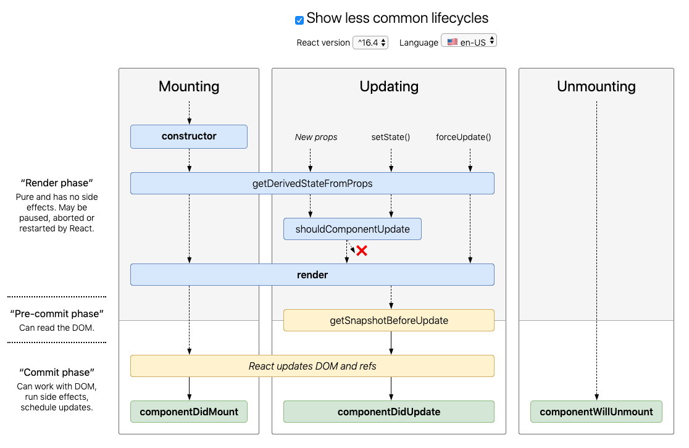

# React 生命周期

Before v16:


V16.4 之后的⽣命周期: <http://projects.wojtekmaj.pl/react-lifecycle-methods-diagram>



V17 可能会废弃的三个⽣命周期函数⽤ `getDerivedStateFromProps` 替代，⽬前使⽤的话加上 UNSAFE\_：

- UNSAFE_componentWillMount
- UNSAFE_componentWillReceiveProps
- UNSAFE_componentWillUpdate

引⼊两个新的⽣命周期函数：

- static getDerivedStateFromProps
- getSnapshotBeforeUpdate

## 组件的生命周期

组件生命周期有三种阶段：初始化阶段（Mounting）、更新阶段（Updating）、析构阶段（Unmouting）。

```js
import React, { Component } from 'react';

/* V17可能会废弃的三个⽣命周期函数⽤getDerivedStateFromProps 替代，⽬前使⽤的话加上UNSAFE_：

- componentWillMount
- componentWillReceiveProps
- componentWillUpdate
*/

export default class LifeCycle extends Component {
  constructor(props) {
    super(props);
    this.state = {
      counter: 0,
    };
    console.log('constructor', this.state.counter);
  }

  static getDerivedStateFromProps(props, state) {
    // getDerivedStateFromProps 会在调⽤ render ⽅法之前调⽤，
    // 并且在初始挂载及后续更新时都会被调⽤。
    // 它应返回⼀个对象来更新 state，如果返回 null 则不更新任何内容。
    const { counter } = state;
    console.log('getDerivedStateFromProps', counter);
    return counter < 8 ? null : { counter: 0 };
  }

  /* UNSAFE_componentWillMount() {
    console.log('componentWillMount', this.state.counter);
  } */

  /* UNSAFE_componentWillUpdate() {
    console.log('componentWillUpdate', this.state.counter);
  } */

  shouldComponentUpdate(nextProps, nextState) {
    const { counter } = this.state;
    console.log('shouldComponentUpdate', counter, nextState.counter);
    return counter !== 5;
  }

  setCounter = () => {
    this.setState({
      counter: this.state.counter + 1,
    });
  };

  render() {
    const { counter } = this.state;
    console.log('render', counter);

    return (
      <div>
        <h1>我是LifeCycle页面</h1>
        <p>{counter}</p>
        <button onClick={this.setCounter}>改变counter</button>
        {!!(counter % 2) && <Foo />}
      </div>
    );
  }

  getSnapshotBeforeUpdate(prevProps, prevState) {
    const { counter } = prevState;
    console.log('getSnapshotBeforeUpdate', counter);
    return null;
  }

  componentDidMount() {
    console.log('componentDidMount', this.state.counter);
  }

  componentDidUpdate() {
    console.log('componentDidUpdate', this.state.counter);
  }

  componentWillUnmount() {
    //组件卸载之前
    console.log('componentWillUnmount', this.state.counter);
  }
}

class Foo extends Component {
  UNSAFE_componentWillReceiveProps(nextProps) {
    //不推荐，将会被废弃
    // UNSAFE_componentWillReceiveProps() 会在已挂载的 组件接收新的 props 之前被调⽤
    console.log('Foo componentWillReceiveProps');
  }

  componentWillUnmount() {
    //组件卸载之前
    console.log(' Foo componentWillUnmount');
  }
  render() {
    return (
      <div>
        我是Foo组件
        <p>Foo counter: {this.props.counter}</p>
      </div>
    );
  }
}
```
