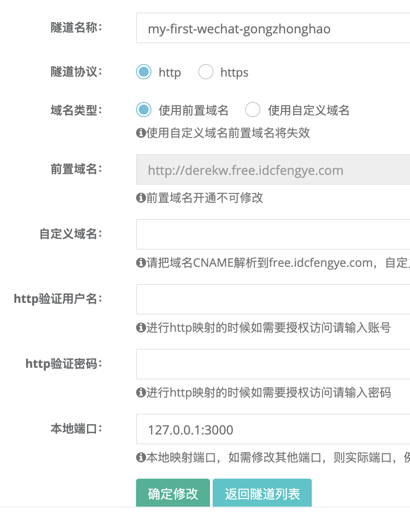
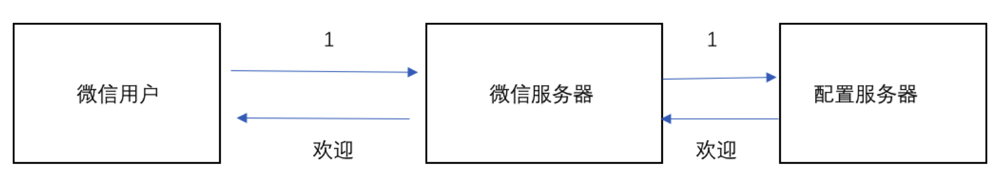
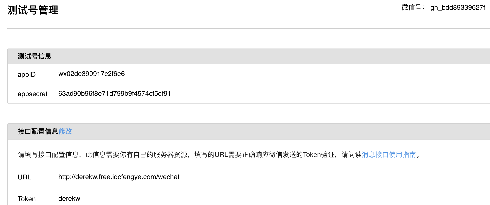

# 微信公众号服务端开发

wechat: https://www.npmjs.com/package/wechat

Wechat API: https://www.npmjs.com/package/wechat-api

Wechat 开发文档：https://developers.weixin.qq.com/doc/offiaccount/OA_Web_Apps/Web_Developer_Tools.html

## 1. 配置 ngrok

安装 sunny-ngrok 实现外网的映射：https://www.ngrok.cc/user.html 隧道管理，开通隧道，有免费服务器。



把 sunny-ngrok 客户端下载，最好放到开发目录下，重命名 bin/sunny, 命令写到 npm 中。运行 `yarn sunny` 会打开隧道。

```shell
"sunny": "./bin/sunny clientid 56326889de28f7aa" # clientid needs to check tunnel

# Result

Sunny-Ngrok   官 网 www.ngrok.cc                                                                                           (Ctrl+C 退 出 )

Tunnel Status                 online
Version                       2.1/2.1
Forwarding                    http://derekw.free.idcfengye.com -> 127.0.0.1:3000
Web Interface                 127.0.0.1:4040
# Conn                        0
Avg Conn Time                 0.00ms
```

## 客服消息

需要安装 npm https://github.com/node-webot/co-wechat



开通公众号测试账号：

1. https://mp.weixin.qq.com

2. 选择 [开发者工具] ——> [公众号平台测试账号]

3. 保存测试号信息 appID, appsecret (**一定要确保 derekw.fee.idcfenyge.com 正常启动再测试，去不一定一次过。。。wechat 真无语。。。**)

   

4. 编写配置文件

   ```javascript
   // conf.js
   module.exports = {
     appid: 'wx02de399917c2f6e6',
     appsecret: '63ad90b96f8e71d799b9f4574cf5df91',
     token: 'derekw',
   };

   // server.js
   const Koa = require('koa');
   const Router = require('koa-router');
   const static = require('koa-static');
   const bodyParser = require('koa-bodyparser');
   const axios = require('axios');
   const wechat = require('co-wechat');

   const conf = require('./conf');

   const app = new Koa();
   const router = new Router();

   app.use(bodyParser());
   app.use(static(__dirname + '/'));

   /*
   消息接口: co-wechat实现
   在微信测试公众号沙箱中，输入 message，微信公众号会回复你 Hello World.
   */
   router.all(
     '/wechat',
     wechat(conf).middleware(async (message) => {
       console.log('wechat: ', message);
       return 'Hello World ' + message.Content;
     }),
   );

   app.use(router.routes()); /*启动路由*/
   app.use(router.allowedMethods());
   app.listen(3000);
   ```

5. 测试号二维码扫码后登陆测试账号，然后发消息 xxx 进行测试。可以看到回复 Hello World xxx。

---

自己实现一个 co-wechat:

```javascript
const Koa = require('koa');
const Router = require('koa-router');
const static = require('koa-static');
const xml2js = require('xml2js');
const url = require('url');
const crypto = require('crypto');
const xmlParser = require('koa-xml-body'); // wechat interface too old

const conf = require('./conf');

const app = new Koa();

app.use(xmlParser());
const router = new Router();
app.use(static(__dirname + '/'));

// 验证
router.get('/wechat', (ctx) => {
  console.log('微信认证...', ctx.url);
  const { query } = url.parse(ctx.url, true);
  const {
    signature, // 微信加密签名，signature结合了开发者填写的token参数和请求中的timestamp参数、nonce参数。
    timestamp, // 时间戳
    nonce, // 随机数
    echostr, // 随机字符串
  } = query;
  console.log('wechat', query);

  // 将 token timestamp nonce 三个参数进行字典序排序并用sha1加密

  let str = [conf.token, timestamp, nonce].sort().join('');
  console.log('str', str);
  let strSha1 = crypto
    .createHash('sha1')
    .update(str)
    .digest('hex');

  console.log(`自己加密后的字符串为：${strSha1}`);
  console.log(`微信传入的加密字符串为：${signature}`);
  console.log(`两者比较结果为：${signature == strSha1}`);

  // 签名对比，相同则按照微信要求返回echostr参数值
  if (signature == strSha1) {
    ctx.body = echostr;
  } else {
    ctx.body = '你不是微信';
  }
});

// 接受信息
router.post('/wechat', (ctx) => {
  const { xml: msg } = ctx.request.body;
  console.log('Receive:', msg);
  const builder = new xml2js.Builder();
  const result = builder.buildObject({
    xml: {
      ToUserName: msg.FromUserName,
      FromUserName: msg.ToUserName,
      CreateTime: Date.now(),
      MsgType: msg.MsgType,
      Content: 'Hello ' + msg.Content,
    },
  });
  ctx.body = result;
});

app.use(router.routes());
app.use(router.allowedMethods());
app.listen(3000);
```

验证部分

crypto 类: https://www.liaoxuefeng.com/wiki/001434446689867b27157e896e74d51a89c25cc8b43bdb3000/001434501504929883d11d84a1541c6907eefd792c0da51000

crypto 模块的目的是为了提供通用的加密和哈希算法。用纯 JavaScript 代码实现这些功能不是不可能， 但速度会非常慢。Nodejs 用 C/C++实现这些算法后，通过 cypto 这个模块暴露为 JavaScript 接口，这样用 起来方便，运行速度也快。

## 3. [服务器端 API 调用](https://developers.weixin.qq.com/doc/offiaccount/Basic_Information/Get_access_token.html)

功能:

- 用户管理: 用户分组、备注姓名、获取用户基本资料、获取用户列表、获取用户地理位置
- 界面设置-定制菜单
- 素材管理

- 推广支持 生成二维码

```javascript
// server.js
/**
 * 使用 co-wechat-api 实现接口 2 和接口 3。实际项目用这个
 */
const { ServerToken } = require('./mongoose');

const WechatAPI = require('co-wechat-api');

const api = new WechatAPI(
  conf.appid,
  conf.appsecret,
  // 取Token
  async () => await ServerToken.findOne(),
  // 存Token
  async (token) => await ServerToken.updateOne({}, token, { upsert: true }),
);

router.get('/getFollowers', async (ctx) => {
  let res = await api.getFollowers();
  res = await api.batchGetUsers(res.data.openid, 'zh_CN');
  ctx.body = res;
});

// mongoose.js
const mongoose = require('mongoose');

const { Schema } = mongoose;

mongoose.connect(
  'mongodb://localhost:27017/weixin',
  {
    useNewUrlParser: true,
  },
  () => {
    console.log('Mongodb connected..');
  },
);

exports.ServerToken = mongoose.model('ServerToken', {
  accessToken: String,
});
```

自己实现：

```javascript
// 后端 access_token, 用于访问 getFollowers 等 API
const tokenCache = {
  access_token: '',
  updateTime: Date.now(),
  expires_in: 7200,
};

// 接口 2：获取 access_token
router.get('/getTokens', async (ctx) => {
  const wxDomain = `https://api.weixin.qq.com`;
  const path = `/cgi-bin/token`;
  const param = `?grant_type=client_credential&appid=${conf.appid}&secret=${conf.appsecret}`;
  const url = wxDomain + path + param;
  const res = await axios.get(url);

  // res:     { data: { access_token: 'xxxx', expires_in: 7200 }, status: 200 }

  Object.assign(tokenCache, res.data, {
    updateTime: Date.now(),
  });
  ctx.body = res.data;
});

// 接口 3：使用 access_token 来调用 getFollowers
router.get('/getFollowers', async (ctx) => {
  const url = `https://api.weixin.qq.com/cgi-bin/user/get?access_token=${tokenCache.access_token}`;
  const res = await axios.get(url);
  console.log('getFollowers: ', res);
  ctx.body = res.data;
});
```

index.html

```html
<html>
  <head>
    <meta charset="UTF-8" />
    <meta name="viewport" content="width=device-width,initial-scale=1,user-scalable=0" />
    <script src="https://unpkg.com/vue@2.1.10/dist/vue.min.js"></script>
    <script src="https://unpkg.com/axios/dist/axios.min.js"></script>
    <script src="https://unpkg.com/cube-ui/lib/cube.min.js"></script>
    <script src="https://cdn.bootcss.com/qs/6.6.0/qs.js"></script>
    <script src="http://res.wx.qq.com/open/js/jweixin-1.4.0.js"></script>
    <link rel="stylesheet" href="https://unpkg.com/cube-ui/lib/cube.min.css" />
    <style>
      .cube-btn {
        margin: 10px 0;
      }
    </style>
  </head>

  <body>
    <div id="app">
      <cube-button @click="getTokens">getTokens</cube-button>
      <cube-button @click="getFollowers">getFollowers</cube-button>
    </div>
    <script>
      var app = new Vue({
        el: '#app',
        data: {
          value: 'input',
        },

        methods: {
          async getTokens() {
            const res = await axios.get('/getTokens');
            console.log('res:', res);
          },
          async getFollowers() {
            const res = await axios.get('/getFollowers');
            console.log('res', res);
          },
        },
        mounted: function() {},
      });
    </script>
  </body>
</html>
```
