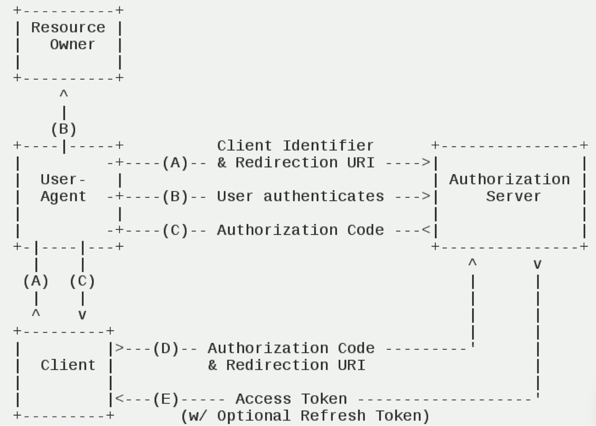
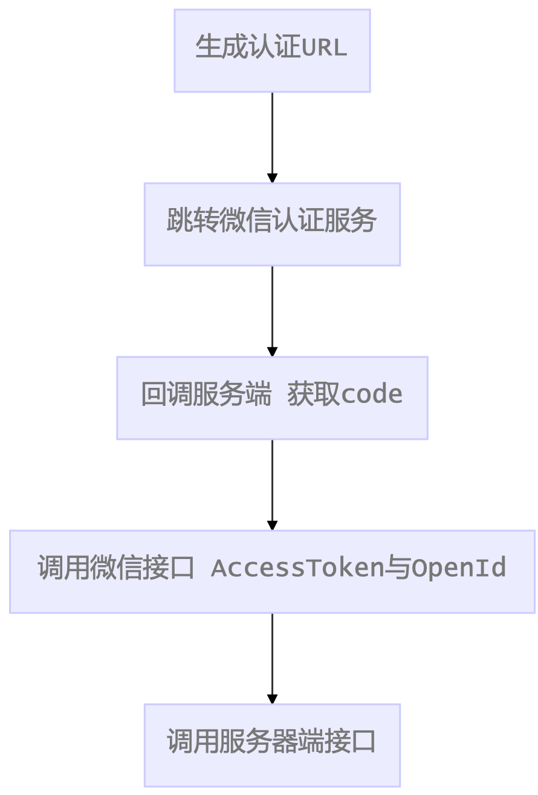
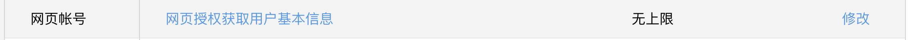
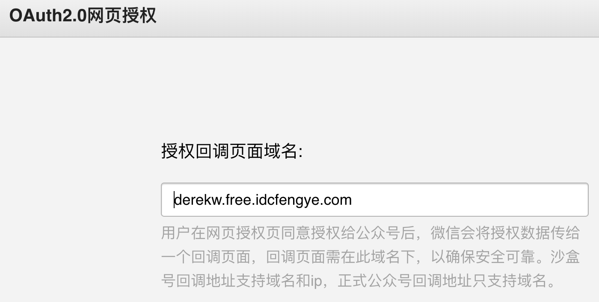
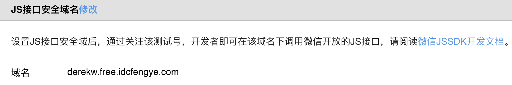
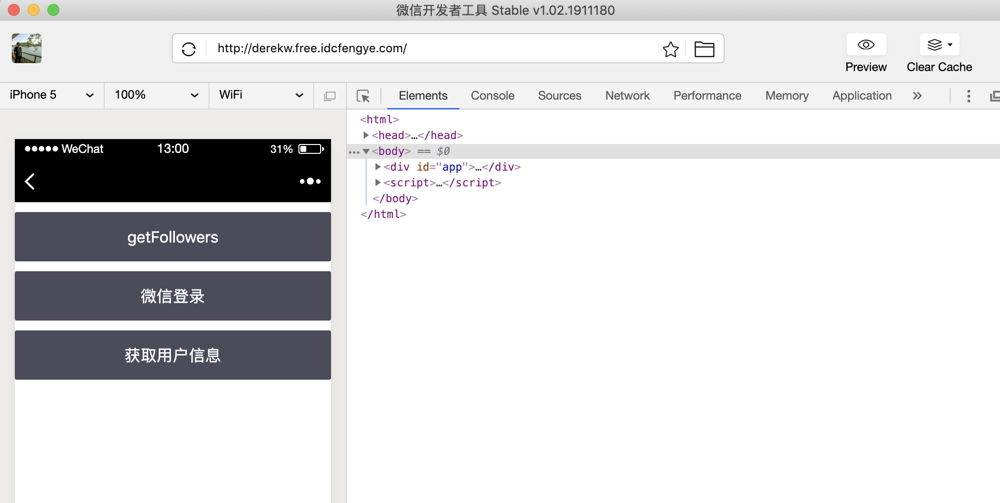
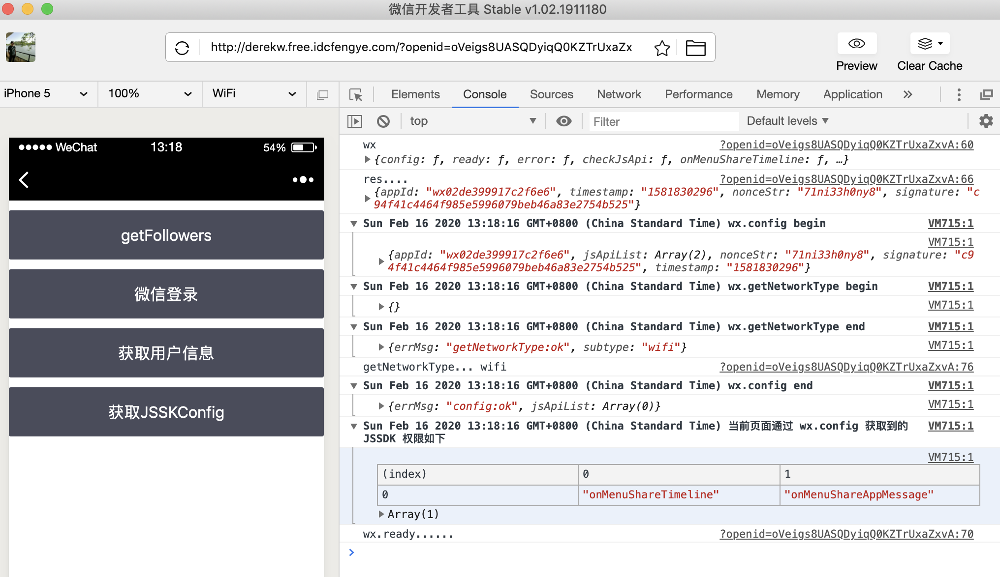

# 公众号网页端

## 网页授权

官方资料 https://mp.weixin.qq.com/wiki?t=resource/res_main&id=mp1421140842

npm 库 https://github.com/node-webot/wechat-oauth

阮一峰的 OAuth2 http://www.ruanyifeng.com/blog/2014/05/oauth_2_0.html

OAuth2.0 的授权码模式 授权码模式（authorization code）是功能最完整、流程最严密的授权模式。它的特点就是通过客户端的后 台服务器，与"服务提供商"的认证服务器进行互动。



（A）用户访问客户端，后者将前者导向认证服务器。

（B）用户选择是否给予客户端授权。

（C）假设用户给予授权，认证服务器将用户导向客户端事先指定的"重定向 URI"（redirection URI），同时 附上一个授权码。

（D）客户端收到授权码，附上早先的"重定向 URI"，向认证服务器申请令牌。这一步是在客户端的后台的服 务器上完成的，对用户不可见。

（E）认证服务器核对了授权码和重定向 URI，确认无误后，向客户端发送访问令牌（access token）和更新令牌（refresh token）。

获取用户信息 - 相当于普通网页的用户登录：



---

1. 配置网页回调：





2. 配置 js 安全接口：

   

3. vue index.html

   ```html
   <h3>网页授权</h3>
   <cube-button v-on:click="auth">微信登录</cube-button>
   <cube-button v-on:click="getUser">获取用户信息</cube-button>

   <script>
     var app = new Vue({
       methods: {
         async auth() {
           window.location.href = '/wxAuthorize';
         },
         async getUser() {
           const qs = Qs.parse(window.location.search.substr(1));
           const res = await axios.get('/getUser', {
             params: {
               openid: qs.openid,
             },
           });
           console.log('User', res.data);
         },
       },
     });
   </script>
   ```

   server.js

   ```javascript
   const OAuth = require('co-wechat-oauth');
   const oauth = new OAuth(conf.appid, conf.appsecret);

   // OAuth2 生成引导用户点击的 URL
   router.get('/wxAuthorize', async (ctx, next) => {
     const state = ctx.query.id;
     // const target = ctx.href
     console.log('ctx...' + ctx.href);
     // 目标地址
     redirectUrl = ctx.href;
     redirectUrl = redirectUrl.replace('wxAuthorize', 'wxCallback');
     const scope = 'snsapi_userinfo';

     var url = oauth.getAuthorizeURL(redirectUrl, state, scope);
     console.log('url: ' + url);
     ctx.redirect(url);
   });

   // 获取AccessToken
   router.get('/wxCallback', async (ctx, next) => {
     const code = ctx.query.code;
     // 授权码
     console.log('getAccessToken', code);
     var token = await oauth.getAccessToken(code);
     var accessToken = token.data.access_token;
     var openid = token.data.openid;
     console.log('getAccessToken....');
     console.log('accessToken', accessToken);
     console.log('openid', openid);
     // ctx.body = token

     ctx.redirect('/?openid=' + openid);
   });

   router.get('/getUser', async (ctx, next) => {
     const openid = ctx.query.openid;
     console.log('getUser', openid);
     var userInfo = await oauth.getUser(openid);
     console.log('userInfo:', userInfo);
     ctx.body = userInfo;
   });
   ```

4. 微信开发者工具网页端操作



点击微信登录，然后 allow，此时再点获取用户信息才能正常访问。console 由内容

5. AccessToken 缓存问题

   ```javascript
   // mongoose.js
   const mongoose = require('mongoose');

   const { Schema } = mongoose;

   mongoose.connect(
     'mongodb://localhost:27017/weixin',
     {
       useNewUrlParser: true,
       useUnifiedTopology: true,
     },
     () => {
       console.log('Mongodb connected..');
     },
   );

   exports.ServerToken = mongoose.model('ServerToken', {
     accessToken: String,
   });

   // ClientAccessToken
   schema = new Schema({
     access_token: String,
     expires_in: Number,
     refresh_token: String,
     openid: String,
     scope: String,
     create_at: String,
   });

   // 自定义getToken方法
   schema.statics.getToken = async function(openid) {
     return await this.findOne({ openid: openid });
   };
   schema.statics.setToken = async function(openid, token) {
     // 有则更新，无则添加
     const query = { openid: openid };
     const options = { upsert: true };

     return await this.updateOne(query, token, options);
   };

   exports.ClientToken = mongoose.model('ClientToken', schema);
   ```

   ```javascript
   // server.js
   const { ServerToken, ClientToken } = require('./mongoose');

   const oauth = new OAuth(
     conf.appid,
     conf.appsecret,
     async function(openid) {
       return await ClientToken.getToken(openid);
     },
     async function(openid, token) {
       return await ClientToken.setToken(openid, token);
     },
   );
   ```

## 微信 JSSDK

官方资料：<https://developers.weixin.qq.com/doc/offiaccount/OA_Web_Apps/JS-SDK.html>

npm 库： <https://github.com/node-webot/co-wechat-api> (获取 JSConfig)

是开发者在网页上通过 JavaScript 代码使用微信原生功能的工具包，开发者可以使用它在网页上录制和播放微 信语音、监听微信分享、上传手机本地图片、拍照等许多能力

- 运行于微信内置浏览器的网页
- 调用微信原生应用如：拍照、语音、扫一扫 分享功能 查到的数据不同
- 图像接口
- 音频接口

```javascript
// server.js

router.get('/getJsConfig', async (ctx) => {
  console.log('getJSSDK...', ctx.query);

  var res = await api.getJsConfig(ctx.query);
  console.log('res', res);
  ctx.body = res;
});
```

```html
<script src="http://res.wx.qq.com/open/js/jweixin-1.4.0.js"></script>

<div id="app">
  <cube-button @click="getJSConfig">获取JSSKConfig</cube-button>
</div>

<script>
  var app = new Vue({
    methods: {
      async getJSConfig() {
        console.log('wx', wx);
        const res = await axios.get('/getJSConfig', {
          params: {
            url: window.location.href,
          },
        });
        console.log('res....', res.data);
        res.data.jsApiList = ['onMenuShareTimeline', 'onMenuShareAppMessage'];
        wx.config(res.data);
        wx.ready(function() {
          console.log('wx.ready......');
        });
        wx.getNetworkType({
          success: function(res) {
            // 返回网络类型2g，3g，4g，wifi
            var networkType = res.networkType;
            console.log('getNetworkType...', networkType);
          },
        });
      },
    },
  });
</script>
```

验证 OAuth 登陆后，点击 jssdk 结果：


