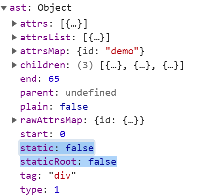
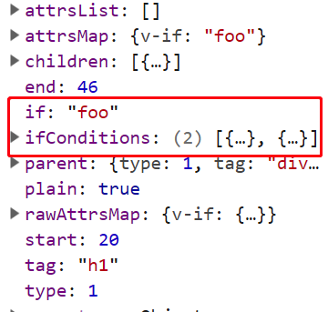

# Vue v2.6.9 源码

1. 调试 vue 项⽬的⽅式

   1. 安装依赖: `npm i`

   2. 安装打包⼯工具: `npm i rollup -g`

   3. 修改 package.json ⾥里里⾯面 dev 脚本:

      ```bash
      "dev": "rollup -w -c scripts/config.js --sourcemap --environment
      TARGET:web-full-dev"
      ```

   4. 执⾏行行打包: `npm run dev`

   5. 修改 samples ⾥里里⾯面的⽂文件引⽤用新⽣生成的 vue.js

2. vue 是如何启动的

3. vue 响应式机制逐⾏分析

---

## 整理理启动顺序

1. platforms/web/entry-runtime-with-compiler.js:

   ```js
   /*
   new Vue({
     template:dom
   }).$mount('#app')
   */

   // 定义 mount：new Vue({ template:dom }).$mount('#app')
   const mount = Vue.prototype.$mount;
   // 挂载时执⾏mountComponent，将dom内容追加⾄el
   Vue.prototype.$mount = function(el?: string | Element, hydrating?: boolean): Component {
     el = el && query(el);

     // ...

     const options = this.$options;
     // 如果options 有 render，直接调用，如果没有 render，根据 template 生成 render 函数
     // resolve template/el and convert to render function !!!
     if (!options.render) {
       let template = options.template;
       if (template) {
         // 判断 template 传入的类型做不同处理
         if (typeof template === 'string') {
           if (template.charAt(0) === '#') {
             template = idToTemplate(template);
           }
         } else if (template.nodeType) {
           template = template.innerHTML;
         }
       } else if (el) {
         template = getOuterHTML(el);
       }
       if (template) {
         const { render, staticRenderFns } = compileToFunctions(
           template,
           {
             // ...
           },
           this,
         );
         options.render = render;
         options.staticRenderFns = staticRenderFns;
       }
     }

     // 调用 mount()
     return mount.call(this, el, hydrating);
   };
   ```

2. src\platforms\web\runtime\index.js

   挂载时执⾏ mountComponent，将 dom 内容追加⾄ el

   ```js
   // public mount method
   Vue.prototype.$mount = function(el?: string | Element, hydrating?: boolean): Component {
     el = el && inBrowser ? query(el) : undefined;
     return mountComponent(this, el, hydrating); // mountComponent!
   };
   ```

   core/instance/lifecycle.js

   创建组件更新函数，创建组件 watcher 实例。

   ```js
   // Line 172
   updateComponent = () => {
     // ⾸先执行 vm._render() 返回VNode
     // 然后VNode作为参数执行update做dom更新
     vm._update(vm._render(), hydrating);
   };
   new Watcher(
     vm,
     updateComponent,
     noop,
     {
       before() {
         if (vm._isMounted && !vm._isDestroyed) {
           callHook(vm, 'beforeUpdate');
         }
       },
     },
     true /* isRenderWatcher */,
   );
   ```

3. src\core\index.js

   ```js
   initGlobalAPI(Vue);
   // 主要做这些事 Vue.set(), Vue.delete, Vue.nextTick...
   ```

4. src\core\instance\index.js

   ```js
   function Vue(options) {
     this._init(options);
   }

   initMixin(Vue); // 实现上⾯面的_init这个初始化⽅方法
   stateMixin(Vue);
   eventsMixin(Vue);
   lifecycleMixin(Vue);
   renderMixin(Vue);
   ```

   - initMixin(Vue):

     ```js
     // 重要，这里列出了执行顺序
     initLifecycle(vm);
     initEvents(vm);
     initRender(vm);
     callHook(vm, 'beforeCreate');
     initInjections(vm); // resolve injections before data/props。defineReactive(vm, key, result[key]) 所以跨层注入也有响应式。
     initState(vm);
     initProvide(vm); // resolve provide after data/props
     callHook(vm, 'created');
     ```

     - initLifecycle: parent, children 等。parent 先于 child 创建
     - initEvents: 事件监听初始化
     - initInjections: 获取注⼊入数据并做响应化
     - initState: 初始化 props, methods, data, computed, watch 等
     - initProvide: 注⼊入数据处理理

   - stateMixin: 实现 watch, set, \$delete

   - eventsMixin(Vue): 实现 emit, on..

   - lifecycleMixin(Vue): 实现 \_update, forceUpdate, destroy

   - renderMixin(Vue): \_render, \$nextTick

## 数据响应式

1. src\core\instance\state.js

   ```js
   // Line54: InitData(), 数组和对象响应化处理理逻辑
   proxy(vm, `_data`, key); // 把 vue.$data.key 挂载到 vue.key 中
   observe(data, true /* asRootData */);
   ```

2. src\core\observer\index.js

   ```js
   // Line 124
   ob = new Observer(value)
   return ob

   /**
   * 对象响应化调用 defineReactive */
   walk (obj: Object) {}

   /**
   * 数组元素响应化 */
   observeArray (items: Array<any>) {}

   /** line 132 对象响应化处理理逻辑
    * Define a reactive property on an Object.
   */
   export function defineReactive (
     obj: Object,
     key: string,
     val: any,
     customSetter?: ?Function,
     shallow?: boolean
   ) {
     const dep = new Dep()

     // ...

     let childOb = !shallow && observe(val)

     // 数据拦截
     Object.defineProperty(obj, key, {
       enumerable: true,
       configurable: true,
       get: function reactiveGetter () {
         const value = getter ? getter.call(obj) : val
         if (Dep.target) {
           // Dep watch 管理
           dep.depend()
           if (childOb) {
             childOb.dep.depend()
             if (Array.isArray(value)) {
               dependArray(value)
             }
           }
         }
         return value
       },
       set: function reactiveSetter (newVal) {
         // ...
         if (setter) {
           setter.call(obj, newVal)
         } else {
           val = newVal
         }
         childOb = !shallow && observe(newVal)
         dep.notify()
       }
     })
   }
   ```

   **数组响应式**

   数组比较特别，它的操作⽅法不会触发 setter，需要特别处理 Observer 把修改过的数组拦截⽅法替换到当前数组对象上可以改变其⾏为

   ```js
   // line 48
   if (hasProto) {
     //数组存在原型就覆盖其原型
     protoAugment(value, arrayMethods);
   } else {
     //不不存在就直接定义拦截⽅方法
     copyAugment(value, arrayMethods, arrayKeys);
   }
   this.observeArray(value);
   ```

3. src\core\observer\array.js

   修改数组 7 个变更⽅法使其可以发送更新通知 arrayMethods

   ```js
   methodsToPatch.forEach(function(method) {
     // cache original method
     const original = arrayProto[method];
     def(arrayMethods, method, function mutator(...args) {
       //该⽅方法默认⾏为
       const result = original.apply(this, args);
       //得到observer
       const ob = this.__ob__;
       let inserted;
       switch (method) {
         case 'push':
         case 'unshift':
           inserted = args;
           break;
         case 'splice':
           inserted = args.slice(2);
           break;
       }
       if (inserted) ob.observeArray(inserted);
       // notify change
       // 额外的事情是通知更新
       ob.dep.notify();
       return result;
     });
   });
   ```

4. src\core\observer\watcher.js

   ```js
   // watcher和dep互相添加引⽤

   addDep (dep: Dep) {
     const id = dep.id
     if (!this.newDepIds.has(id)) {
       this.newDepIds.add(id)
       this.newDeps.push(dep)
       if (!this.depIds.has(id)) {
         dep.addSub(this)
       }
     }
   }
   ```

   watcher 更新逻辑: 通常情况下会执⾏ queueWatcher，执行异步更新

   ```js
   update () {
     /* istanbul ignore else */
     if (this.lazy) {
       this.dirty = true
     } else if (this.sync) {
       this.run()
     } else {
       queueWatcher(this)
     }
   }

   ```

5. src\core\observer\scheduler.js

   queueWatcher 推⼊入队列，下个刷新周期执⾏批量任务，这是 vue 异步更新实现的关键

   ```js
   // Line 158
   queue.push(watcher);
   nextTick(flushSchedulerQueue);
   ```

   nextTick 将 flushSchedulerQueue 加⼊入回调数组，启动 timerFunc 准备执⾏

   ```js
   callbacks.push(() => cb.call(ctx));
   timerFunc(); // line 44
   ```

   timerFunc 指定了了 vue 异步执⾏策略，根据执⾏环境，⾸选 Promise，备选依次为: MutationObserver、setImmediate、setTimeout

---

## 虚拟 DOM

1. src\core\instance\render.js: 获取组件 vnode

   ```js
   // Line 71
   const { render, _parentVnode } = vm.$options;
   // Line 91
   vnode = render.call(vm._renderProxy, vm.$createElement);
   ```

2. src\core\instance\lifecycle.js: 执行 patching 算法，初始化或更新 vnode ⾄\$el

   ```js
   // line 67
   if (!prevVnode) {
     // initial render: 如果没有老vnode，说明在初始化
     vm.$el = vm.__patch__(vm.$el, vnode, hydrating, false /* removeOnly */);
   } else {
     // updates: 更新周期直接diff，返回新的dom
     vm.$el = vm.__patch__(prevVnode, vnode);
   }
   ```

3. src\platforms\web\runtime\patch.js: 定义组件实例补丁方法

   ```js
   Vue.prototype.__patch__ = inBrowser ? patch : noop;
   ```

4. src\core\vdom\patch.js: 创建浏览器平台特有 patch 函数，主要负责 dom 更新操作

   ```js
   // 扩展操作:把通⽤模块和浏览器中特有模块合并
   const modules = platformModules.concat(baseModules);

   // 工厂函数:创建浏览器特有的patch函数，这⾥主要解决跨平台问题
   export const patch: Function = createPatchFunction({ nodeOps, modules });
   ```

### patch

那么 patch 如何⼯作的呢？

⾸先说⼀下 patch 的核⼼ diff 算法：通过**同层的树节点进⾏⽐较**⽽⾮对树进⾏逐层搜索遍历的⽅式，所以时间复杂度只有 O(n)，是⼀种相当⾼效的算法。

同层级只做三件事：增删改。

具体规则是：new VNode 不存在就删；old VNode 不存在就增；都存在就⽐较类型，类型不同直接替换、类型相同执⾏更新；

```js
/*createPatchFunction的返回值，⼀个patch函数*/
return function patch(oldVnode, vnode, hydrating, removeOnly) {
  /*vnode不存在则删*/
  if (isUndef(vnode)) {
    if (isDef(oldVnode)) invokeDestroyHook(oldVnode);
    return;
  }

  let isInitialPatch = false;
  const insertedVnodeQueue = [];

  if (isUndef(oldVnode)) {
    /*oldVnode不存在则创建新节点*/
    // empty mount (likely as component), create new root element
    isInitialPatch = true;
    createElm(vnode, insertedVnodeQueue);
  } else {
    /*oldVnode有nodeType，说明传递进来⼀个DOM元素*/
    const isRealElement = isDef(oldVnode.nodeType);
    if (!isRealElement && sameVnode(oldVnode, vnode)) {
      // patch existing root node
      /*是组件且是同⼀个节点的时候打补丁*/
      patchVnode(oldVnode, vnode, insertedVnodeQueue, null, null, removeOnly);
    } else {
      /*传递进来oldVnode是dom元素*/
      if (isRealElement) {
        // mounting to a real element
        // check if this is server-rendered content and if we can perform
        // a successful hydration.
        if (oldVnode.nodeType === 1 && oldVnode.hasAttribute(SSR_ATTR)) {
          oldVnode.removeAttribute(SSR_ATTR);
          hydrating = true;
        }
        if (isTrue(hydrating)) {
          if (hydrate(oldVnode, vnode, insertedVnodeQueue)) {
            invokeInsertHook(vnode, insertedVnodeQueue, true);
            return oldVnode;
          }
        }
        // either not server-rendered, or hydration failed.
        // create an empty node and replace it
        // 将该dom元素清空
        oldVnode = emptyNodeAt(oldVnode);
      }

      // replacing existing element
      const oldElm = oldVnode.elm;
      const parentElm = nodeOps.parentNode(oldElm);

      // create new node
      createElm(
        vnode,
        insertedVnodeQueue,
        // extremely rare edge case: do not insert if old element is in a
        // leaving transition. Only happens when combining transition +
        // keep-alive + HOCs. (#4590)
        oldElm._leaveCb ? null : parentElm,
        nodeOps.nextSibling(oldElm),
      );

      // update parent placeholder node element, recursively
      if (isDef(vnode.parent)) {
        let ancestor = vnode.parent;
        const patchable = isPatchable(vnode);
        while (ancestor) {
          for (let i = 0; i < cbs.destroy.length; ++i) {
            cbs.destroy[i](ancestor);
          }
          ancestor.elm = vnode.elm;
          if (patchable) {
            for (let i = 0; i < cbs.create.length; ++i) {
              cbs.create[i](emptyNode, ancestor);
            }
            // #6513
            // invoke insert hooks that may have been merged by create hooks.
            // e.g. for directives that uses the "inserted" hook.
            const insert = ancestor.data.hook.insert;
            if (insert.merged) {
              // start at index 1 to avoid re-invoking component mounted hook
              for (let i = 1; i < insert.fns.length; i++) {
                insert.fns[i]();
              }
            }
          } else {
            registerRef(ancestor);
          }
          ancestor = ancestor.parent;
        }
      }

      // destroy old node
      if (isDef(parentElm)) {
        /*移除⽼节点*/
        removeVnodes(parentElm, [oldVnode], 0, 0);
      } else if (isDef(oldVnode.tag)) {
        /*调⽤destroy钩⼦*/
        invokeDestroyHook(oldVnode);
      }
    }
  }

  /*调⽤insert钩⼦*/
  invokeInsertHook(vnode, insertedVnodeQueue, isInitialPatch);
  return vnode.elm;
};
```

### patchVnode

两个 VNode 类型相同，就执⾏更新操作，包括三种类型操作：**属性更新 PROPS、⽂本更新 TEXT、⼦节点更新 REORDER**

patchVnode 具体规则如下：

1. 如果新旧 VNode 都是**静态的**，同时它们的 key 相同（代表同⼀节点），并且新的 VNode 是 clone 或 者是标记了 v-once，那么只需要替换 elm 以及 componentInstance 即可。
2. 新⽼节点均有 **children ⼦节点**，则对⼦节点进⾏ diff 操作，调⽤ **updateChildren**，这个 updateChildren 也是 diff 的核⼼。
3. 如果**⽼节点没有⼦节点⽽新节点存在⼦节点**，先清空⽼节点 DOM 的⽂本内容，然后为当前 DOM 节 点加⼊⼦节点。
4. 当**新节点没有⼦节点⽽⽼节点有⼦节点的时候**，则移除该 DOM 节点的所有⼦节点。
5. 当**新⽼节点都⽆⼦节点**的时候，只是⽂本的替换。

```js
/*patch VNode节点*/

function patchVnode(oldVnode, vnode, insertedVnodeQueue, ownerArray, index, removeOnly) {
  /*两个VNode节点相同则直接返回*/
  if (oldVnode === vnode) {
    return;
  }
  if (isDef(vnode.elm) && isDef(ownerArray)) {
    // clone reused vnode
    vnode = ownerArray[index] = cloneVNode(vnode);
  }

  const elm = (vnode.elm = oldVnode.elm);
  /* 如果新旧VNode都是静态的，同时它们的key相同（代表同⼀节点）， 并且新的VNode是clone或者是标记了once（标记v-once属性，只渲染⼀次）， 那么只需要替换elm以及componentInstance即可。 */
  if (
    isTrue(vnode.isStatic) &&
    isTrue(oldVnode.isStatic) &&
    vnode.key === oldVnode.key &&
    (isTrue(vnode.isCloned) || isTrue(vnode.isOnce))
  ) {
    vnode.elm = oldVnode.elm;
    vnode.componentInstance = oldVnode.componentInstance;
    return;
  }

  /*如果存在data.hook.prepatch则要先执⾏*/

  let i;
  const data = vnode.data;
  if (isDef(data) && isDef((i = data.hook)) && isDef((i = i.prepatch))) {
    i(oldVnode, vnode);
  }

  const oldCh = oldVnode.children;
  const ch = vnode.children;

  /*执⾏属性、事件、样式等等更新操作*/

  if (isDef(data) && isPatchable(vnode)) {
    for (i = 0; i < cbs.update.length; ++i) {
      cbs.update[i](oldVnode, vnode);
    }

    if (isDef((i = data.hook)) && isDef((i = i.update))) {
      i(oldVnode, vnode);
    }
  }

  /*开始判断children的各种情况*/
  /*如果这个VNode节点没有text⽂本时*/

  if (isUndef(vnode.text)) {
    if (isDef(oldCh) && isDef(ch)) {
      /*新⽼节点均有children⼦节点，则对⼦节点进⾏diff操作，调⽤updateChildren*/

      if (oldCh !== ch) {
        updateChildren(elm, oldCh, ch, insertedVnodeQueue, removeOnly);
      }
    } else if (isDef(ch)) {
      /*如果⽼节点没有⼦节点⽽新节点存在⼦节点，先清空elm的⽂本内容，然后为当前节点加⼊⼦ 节点*/
      if (isDef(oldVnode.text)) {
        nodeOps.setTextContent(elm, '');
      }
      addVnodes(elm, null, ch, 0, ch.length - 1, insertedVnodeQueue);
    } else if (isDef(oldCh)) {
      /*当新节点没有⼦节点⽽⽼节点有⼦节点的时候，则移除所有ele的⼦节点*/
      removeVnodes(elm, oldCh, 0, oldCh.length - 1);
    } else if (isDef(oldVnode.text)) {
      /*当新⽼节点都⽆⼦节点的时候，只是⽂本的替换，因为这个逻辑中新节点text不存在，所以 清除ele⽂本*/ nodeOps.setTextContent(
        elm,
        '',
      );
    }
  } else if (oldVnode.text !== vnode.text) {
    /*当新⽼节点text不⼀样时，直接替换这段⽂本*/
    nodeOps.setTextContent(elm, vnode.text);
  }
  /*调⽤postpatch钩⼦*/
  if (isDef(data)) {
    if (isDef((i = data.hook)) && isDef((i = i.postpatch))) {
      i(oldVnode, vnode);
    }
  }
}
```

### updateChildren

updateChildren 主要作⽤是⽤⼀种较⾼效的⽅式⽐对新旧两个 VNode 的 children 得出最⼩操作补丁。执⾏⼀个双循环是传统⽅式，vue 中针对 web 场景特点做了特别的算法优化。

在新⽼两组 VNode 节点的左右头尾两侧都有⼀个变量标记，在遍历过程中这⼏个变量都会向中间靠拢。 当 oldStartIdx > oldEndIdx 或者 newStartIdx > newEndIdx 时结束循环。

下⾯是遍历规则：

⾸先，oldStartVnode、oldEndVnode 与 newStartVnode、newEndVnode 两两交叉⽐较，共有 4 种⽐较 ⽅法。

当 oldStartVnode 和 newStartVnode 或者 oldEndVnode 和 newEndVnode 满⾜ sameVnode，直接将该 VNode 节点进⾏ patchVnode 即可，不需再遍历就完成了⼀次循环。如下图，

如果 oldStartVnode 与 newEndVnode 满⾜ sameVnode。说明 oldStartVnode 已经跑到了 oldEndVnode 后⾯去了，进⾏ patchVnode 的同时还需要将真实 DOM 节点移动到 oldEndVnode 的后⾯。

如果 oldEndVnode 与 newStartVnode 满⾜ sameVnode，说明 oldEndVnode 跑到了 oldStartVnode 的前 ⾯，进⾏ patchVnode 的同时要将 oldEndVnode 对应 DOM 移动到 oldStartVnode 对应 DOM 的前⾯。

如果以上情况均不符合，则在 old VNode 中找与 newStartVnode 满⾜ sameVnode 的 vnodeToMove，若 存在执⾏ patchVnode，同时将 vnodeToMove 对应 DOM 移动到 oldStartVnode 对应的 DOM 的前⾯。

当然也有可能 newStartVnode 在 old VNode 节点中找不到⼀致的 key，或者是即便 key 相同却不是 sameVnode，这个时候会调⽤ createElm 创建⼀个新的 DOM 节点。

⾄此循环结束，但是我们还需要处理剩下的节点。

当结束时 oldStartIdx > oldEndIdx，这个时候旧的 VNode 节点已经遍历完了，但是新的节点还没有。说 明了新的 VNode 节点实际上⽐⽼的 VNode 节点多，需要将剩下的 VNode 对应的 DOM 插⼊到真实 DOM 中，此时调⽤ addVnodes（批量调⽤ createElm 接⼝）。

但是，当结束时 newStartIdx > newEndIdx 时，说明新的 VNode 节点已经遍历完了，但是⽼的节点还有 剩余，需要从⽂档中删 的节点删除。

```js
function updateChildren(parentElm, oldCh, newCh, insertedVnodeQueue, removeOnly) {
  let oldStartIdx = 0;
  let newStartIdx = 0;
  let oldEndIdx = oldCh.length - 1;
  let oldStartVnode = oldCh[0];
  let oldEndVnode = oldCh[oldEndIdx];
  let newEndIdx = newCh.length - 1;
  let newStartVnode = newCh[0];
  let newEndVnode = newCh[newEndIdx];
  let oldKeyToIdx, idxInOld, elmToMove, refElm;

  // 确保移除元素在过度动画过程中待在正确的相对位置，仅⽤于<transition-group> const canMove = !removeOnly
  // 循环条件：任意起始索引超过结束索引就结束
  while (oldStartIdx <= oldEndIdx && newStartIdx <= newEndIdx) {
    if (isUndef(oldStartVnode)) {
      oldStartVnode = oldCh[++oldStartIdx]; // Vnode has been moved left } else if (isUndef(oldEndVnode)) {

      oldEndVnode = oldCh[--oldEndIdx];
    } else if (sameVnode(oldStartVnode, newStartVnode)) {
      /*分别⽐较oldCh以及newCh的两头节点4种情况，判定为同⼀个VNode，则直接patchVnode即可*/
      patchVnode(oldStartVnode, newStartVnode, insertedVnodeQueue);
      oldStartVnode = oldCh[++oldStartIdx];
      newStartVnode = newCh[++newStartIdx];
    } else if (sameVnode(oldEndVnode, newEndVnode)) {
      patchVnode(oldEndVnode, newEndVnode, insertedVnodeQueue);
      oldEndVnode = oldCh[--oldEndIdx];
      newEndVnode = newCh[--newEndIdx];
    } else if (sameVnode(oldStartVnode, newEndVnode)) {
      // Vnode moved right
      patchVnode(oldStartVnode, newEndVnode, insertedVnodeQueue);
      canMove &&
        nodeOps.insertBefore(parentElm, oldStartVnode.elm, nodeOps.nextSibling(oldEndVnode.elm));
      oldStartVnode = oldCh[++oldStartIdx];
      newEndVnode = newCh[--newEndIdx];
    } else if (sameVnode(oldEndVnode, newStartVnode)) {
      // Vnode moved left
      patchVnode(oldEndVnode, newStartVnode, insertedVnodeQueue);
      canMove && nodeOps.insertBefore(parentElm, oldEndVnode.elm, oldStartVnode.elm);
      oldEndVnode = oldCh[--oldEndIdx];
      newStartVnode = newCh[++newStartIdx];
    } else {
      /* ⽣成⼀个哈希表，key是旧VNode的key，值是该VNode在旧VNode中索引 */
      if (isUndef(oldKeyToIdx)) oldKeyToIdx = createKeyToOldIdx(oldCh, oldStartIdx, oldEndIdx);
      /*如果newStartVnode存在key并且这个key在oldVnode中能找到则返回这个节点的索引*/
      idxInOld = isDef(newStartVnode.key) ? oldKeyToIdx[newStartVnode.key] : null;
      if (isUndef(idxInOld)) {
        /*没有key或者是该key没有在⽼节点中找到则创建⼀个新的节点*/
        createElm(newStartVnode, insertedVnodeQueue, parentElm, oldStartVnode.elm);
        newStartVnode = newCh[++newStartIdx];
      } else {
        /*获取同key的⽼节点*/
        elmToMove = oldCh[idxInOld];
        if (sameVnode(elmToMove, newStartVnode)) {
          /*如果新VNode与得到的有相同key的节点是同⼀个VNode则进⾏patchVnode*/
          patchVnode(elmToMove, newStartVnode, insertedVnodeQueue);
          /*因为已经patchVnode进去了，所以将这个⽼节点赋值undefined，之后如果还有新节 点与该节点key相同可以检测出来提示已有重复的key*/
          oldCh[idxInOld] = undefined;
          /*当有标识位canMove实可以直接插⼊oldStartVnode对应的真实DOM节点前⾯*/
          canMove && nodeOps.insertBefore(parentElm, newStartVnode.elm, oldStartVnode.elm);
          newStartVnode = newCh[++newStartIdx];
        } else {
          /*当新的VNode与找到的同样key的VNode不是sameVNode的时候（⽐如说tag不⼀样或 者是有不⼀样type的input标签），创建⼀个新的节点*/
          createElm(newStartVnode, insertedVnodeQueue, parentElm, oldStartVnode.elm);
          newStartVnode = newCh[++newStartIdx];
        }
      }
    }
  }

  if (oldStartIdx > oldEndIdx) {
    /*全部⽐较完成以后，发现oldStartIdx > oldEndIdx的话，说明⽼节点已经遍历完了，新节 点⽐⽼节点多，所以这时候多出来的新节点需要⼀个⼀个创建出来加⼊到真实DOM中*/
    refElm = isUndef(newCh[newEndIdx + 1]) ? null : newCh[newEndIdx + 1].elm;
    addVnodes(parentElm, refElm, newCh, newStartIdx, newEndIdx, insertedVnodeQueue);
  } else if (newStartIdx > newEndIdx) {
    /*如果全部⽐较完成以后发现newStartIdx > newEndIdx，则说明新节点已经遍历完了，⽼节 点多余新节点，这个时候需要将多余的⽼节点从真实DOM中移除*/
    removeVnodes(parentElm, oldCh, oldStartIdx, oldEndIdx);
  }
}
```

### 属性更新如何实现的

```js
//patch.js
const hooks = ['create', 'activate', 'update', 'remove', 'destroy'];

export function createPatchFunction(backend) {
  // 传递进来的扩展模块和节点操作对象
  const { modules, nodeOps } = backend;
  for (i = 0; i < hooks.length; ++i) {
    // cbs['update'] = []
    cbs[hooks[i]] = [];
    //modules: [ attrs, klass, events, domProps, style, transition]
    for (j = 0; j < modules.length; ++j) {
      // modules[0]['update'] 是创建属性执⾏函数，其他hook以此类推
      if (isDef(modules[j][hooks[i]])) {
        cbs[hooks[i]].push(modules[j][hooks[i]]);
      }
    }
    // cbs['update']: [fn,fn,fn....]
  }

  function patchVnode(args) {
    if (isDef(data) && isPatchable(vnode)) {
      // 每次patch时先对属性做更新
      for (i = 0; i < cbs.update.length; ++i) cbs.update[i](oldVnode, vnode);
      if (isDef((i = data.hook)) && isDef((i = i.update))) i(oldVnode, vnode);
    }
  }
}
```

## 模板编译

模板编译的主要⽬标是将模板(template)转换为渲染函数(render)

Vue 2.0 需要⽤到 VNode 描述视图以及各种交互，⼿写显然不切实际，因此⽤户只需编写类似 HTML 代码 的 Vue 模板，通过编译器将模板转换为可返回 VNode 的 render 函数。

### 体验模板编译

带编译器的版本中，可以使⽤ template 或 el 的⽅式声明模板

```html
<div id="demo">
  <h1>Vue.js测试</h1>
  <p>{{foo}}</p>
</div>
<script>
  // 使⽤el⽅式
  new Vue({ data: { foo: 'foo' }, el: '#demo' });
</script>
```

```html
<script>
  const app = new Vue({});
  // 输出render函数
  console.log(app.$options.render);
</script>
```

输出结果⼤致如下：

```js
function anonymous() {
  with (this) {
    return _c('div', { attrs: { id: 'demo' } }, [
      _c('h1', [_v('Vue.js测试')]),
      _v(' '),
      _c('p', [_v(_s(foo))]),
    ]);
  }
}
```

- 元素节点使⽤ createElement 创建，别名\_c
- 本⽂节点使⽤ createTextVNode 创建，别名\_v
- 表达式先使⽤ toString 格式化，别名\_s

### 模板编译过程

实现模板编译共有三个阶段：解析、优化和⽣成

#### 1. 解析 - parse

解析器将模板解析为抽象语法树 AST，只有将模板解析成 AST 后，才能基于它做优化或者⽣成代码字符 串。 调试查看得到的 AST，/src/compiler/parser/index.js，结构如下：


解析器内部分了 HTML 解析器、⽂本解析器和过滤器解析器，最主要是 HTML 解析器，核⼼算法说明：

```js
//src/compiler/parser/index.js
parseHTML(template, {
  start(tag, attrs, unary) {}, // 遇到开始标签的处理
  end() {}, // 遇到结束标签的处理
  chars(text) {}, // 遇到⽂本标签的处理
  comment(text) {}, // 遇到注释标签的处理
});
```

#### 2. 优化 - optimize

优化器的作⽤是在 AST 中找出静态⼦树并打上标记。静态⼦树是在 AST 中永远不变的节点，如纯⽂本节 点。 标记静态⼦树的好处：

- 每次重新渲染，不需要为静态⼦树创建新节点
- 虚拟 DOM 中 patch 时，可以跳过静态⼦树

代码实现，src/compiler/optimizer.js - optimize

```js
export function optimize(root: ?ASTElement, options: CompilerOptions) {
  if (!root) return (isStaticKey = genStaticKeysCached(options.staticKeys || ''));
  isPlatformReservedTag = options.isReservedTag || no; // 找出静态节点并标记
  markStatic(root); // 找出静态根节点并标记
  markStaticRoots(root, false);
}
```

标记结束



### 3. 代码⽣成 - generate

将 AST 转换成渲染函数中的内容，即代码字符串。 generate ⽅法⽣成渲染函数代码，src/compiler/codegen/index.js

```ts
export function generate(ast: ASTElement | void, options: CompilerOptions): CodegenResult {
  const state = new CodegenState(options);
  const code = ast ? genElement(ast, state) : '_c("div")';
  return { render: `with(this){return ${code}}`, staticRenderFns: state.staticRenderFns };
}

//⽣成的code⻓这样
`_c('div',{attrs:{"id":"demo"}},[
  _c('h1',[_v("Vue.js测试")]),
  _c('p',[_v(_s(foo))])
])`;
```

### v-if、v-for 学习

着重观察⼏个结构性指令的解析过程

```js
// 解析v-if，parser/index.js
function processIf(el) {
  const exp = getAndRemoveAttr(el, 'v-if');
  // 获取v-if=“exp"中exp并删除v-if属性
  if (exp) {
    el.if = exp; // 为ast添加if表示条件
    addIfCondition(el, {
      // 为ast添加ifConditions表示各种情况对应结果
      exp: exp,
      block: el,
    });
  } else {
    // 其他情况处理
    if (getAndRemoveAttr(el, 'v-else') != null) {
      el.else = true;
    }
    const elseif = getAndRemoveAttr(el, 'v-else-if');
    if (elseif) {
      el.elseif = elseif;
    }
  }
}

// 代码⽣成，codegen/index.js
function genIfConditions(
  conditions: ASTIfConditions,
  state: CodegenState,
  altGen?: Function,
  altEmpty?: string,
): string {
  const condition = conditions.shift();
  // 每次处理⼀个条件
  if (condition.exp) {
    // 每种条件⽣成⼀个三元表达式
    return `(${condition.exp})?${genTernaryExp(condition.block)}:${genIfConditions(
      conditions,
      state,
      altGen,
      altEmpty,
    )}`;
  } else {
    return `${genTernaryExp(condition.block)}`;
  }

  // v-if with v-once should generate code like (a)?_m(0):_m(1)
  function genTernaryExp(el) {}
}
```

解析结果：



⽣成结果：

```js
`with(this){return _c('div',{attrs:{"id":"demo"}},[
  (foo) ? _c('h1',[_v(_s(foo))]) : _c('h1',[_v("no title")]), _v(" "),_c('abc')],1)}`;
```

### 插槽

组件编译的顺序是先编译⽗组件，再编译⼦组件。

普通插槽是在⽗组件编译和渲染阶段⽣成 vnodes ，数据的作⽤域是⽗组件，⼦组件渲染的时候直接拿 到这些渲染好的 vnodes 。

作⽤域插槽，⽗组件在编译和渲染阶段并不会直接⽣成 vnodes ，⽽是在⽗节点保留⼀个 scopedSlots 对象，存储着不同名称的插槽以及它们对应的渲染函数，只有在编译和渲染⼦组件阶段才会执⾏这个渲染函数⽣成 vnodes ，由于是在⼦组件环境执⾏的，所以对应的数据作⽤域是⼦组件实 例。

解析相关代码：

```js
// processSlotContent：处理<template v-slot:xxx="yyy">
const slotBinding = getAndRemoveAttrByRegex(el, slotRE);
if (slotBinding) {
  // 查找v-slot:xxx
  const { name, dynamic } = getSlotName(slotBinding); // name是xxx

  el.slotTarget = name; // xxx赋值到slotTarget

  el.slotTargetDynamic = dynamic;

  el.slotScope = slotBinding.value || emptySlotScopeToken; // yyy赋值到 slotScope
}

// processSlotOutlet：处理<slot>
if (el.tag === 'slot') {
  el.slotName = getBindingAttr(el, 'name');
  // 获取slot的name并赋值到slotName
}
```

⽣成相关代码：

```js
// genScopedSlot：这⾥把slotScope作为形参转换为⼯⼚函数返回内容
const fn =
  `function(${slotScope}){` +
  `return ${
    el.tag === 'template'
      ? el.if && isLegacySyntax
        ? `(${el.if})?${genChildren(el, state) || 'undefined'}:undefined`
        : genChildren(el, state) || 'undefined'
      : genElement(el, state)
  }}`;
// reverse proxy v-slot without scope on this.$slots
const reverseProxy = slotScope ? `` : `,proxy:true`;
return `{key:${el.slotTarget || `"default"`},fn:${fn}${reverseProxy}}`;
```

