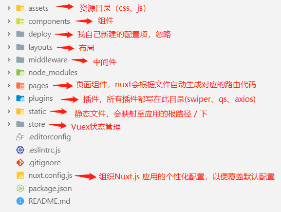
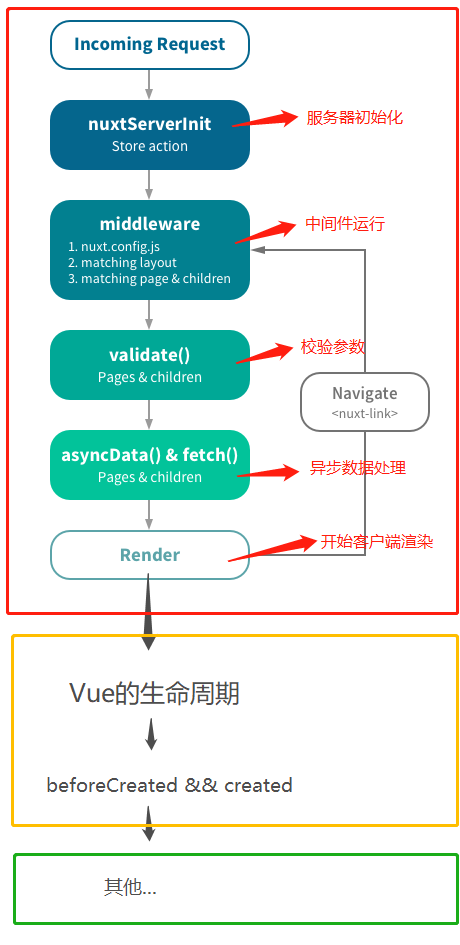

# SSR: server render

1. <https://ssr.vuejs.org/zh/>
2. <https://nuxtjs.org/>



## nuxt 渲染过程

生命周期流程图，**红框内的是 Nuxt 的生命周期(运行在服务端)，黄框内同时运行在服务端&&客户端上，绿框内则运行在客户端**



红框、黄框内的周期都不存在 Window 对象

```js
<script>
export default {
  asyncData() {
    console.log(window) // 服务端报错
  },
  fetch() {
    console.log(window) // 服务端报错
  },
  created () {
    console.log(window) // undefined
  },
  mounted () {
    console.log(window) // Window {postMessage: ƒ, blur: ƒ, focus: ƒ, close: ƒ, frames: Window, …}
  }
}
</script>
```

## nuxt 安装

`npx create-nuxt-app <项⽬名>`

### 路由⽣成

pages ⽬录中所有 `*.vue` ⽂件⾃动⽣成应⽤的路由配置

> 查看.nuxt/router.js 验证⽣成路由

### 导航

添加路由导航，layouts/default.vue

```html
<template>
  <div>
    <nav>
      <!-- 别名：n-link，NLink，NuxtLink -->
      <nuxt-link to="/">Home</nuxt-link>
      <NLink to="/admin">Admin</NLink>
      <n-link to="/cart">Cart</n-link>

      <!-- 不会预加载的页面，以上会偷偷被预加载 -->
      <NuxtLink to="/no-prefetch" no-prefetch>page not pre-fetched </NuxtLink>
    </nav>

    <div>
      <!-- a container for pages -->
      <nuxt />
    </div>
  </div>
</template>
```

> 禁⽤预加载： `<n-link no-prefetch>page not pre-fetched</n-link>`

### 动态路由 routes with optional parameter

以下划线作为前缀的 .vue ⽂件 或 ⽬录会被定义为动态路由，如下⾯⽂件结构

```
pages/
--| detail/
----| _id.vue
```

any Folder or File starts with \_ will generate optional parameter in a route.

e.g. `pages/detail/_id.vue` will generate below:

```json
{
  "path": "/detail/:id?",
  "component": _063cf108,
  "name": "detail-id"
}
```

**in the \_id.vue page, we can access the optional parameter by `$route.params.id`.**

```
<template>
  <div>detail with id: {{ $route.params.id }}</div>
</template>

<script>
export default {
// 如果校验失败，则自动跳转到错误页面
  validate({ params, query }) {
    return /^\d+$/.test(Number(params.id)); // must be number
  }
};
</script>

<style lang="scss" scoped></style>

```

### 嵌套路由

创建内嵌⼦路由，你需要添加⼀个 .vue ⽂件，同时添加⼀个与该⽂件同名的⽬录⽤来存放⼦视图组件。 构造⽂件结构如下：

```
pages/
--| nested/
----| test.vue
--| nested.vue
```

nested.vue

```html
<template>
  <div>
    <h2>nested.vue</h2>

    <!-- container for nested component -->
    <nuxt></nuxt>
  </div>
</template>
```

nested/test.vue

```html
<template>
  <div>
    nested/test.vue
  </div>
</template>
```

Try to access`localhost:3000/nested` and `localhost:3000/nested/test`. The first only displays nested.vue, the latter displays both nested.vue and nested/test.vue.

Route is

```json
{
  "path": "/nested",
  "component": _21365f83,
  "name": "nested",
  "children": [
    {
      "path": "test",
      "component": _7e192564,
      "name": "nested-test"
    }
  ]
}
```

### 默认布局

查看 layouts/default.vue

```html
<template>
  <nuxt />
</template>
```

### ⾃定义布局

创建空⽩布局⻚⾯ layouts/blank.vue ，⽤于 login.vue

```html
<div>
  <!-- a container for pages -->
  <nuxt />
</div>
```

⻚⾯ pages/login.vue 使⽤⾃定义布局：

```js
export default { layout: 'blank' };
```

### ⾃定义错误⻚⾯

创建 layouts/error.vue

```html
<template>
  <div>
    <p>
      Whenever this is an error, display this page. More
      <a href="https://nuxtjs.org/guide/views#error-page">nuxt error</a>
    </p>
    <p>{{ error }}</p>
    <h1 v-if="error.statusCode === 404">Page not found</h1>
    <h1 v-else>An error occurred</h1>
    <nuxt-link to="/">Home page</nuxt-link>
  </div>
</template>

<script>
  export default {
    props: ['error'],
    layout: 'blank', // use blank layout. otherwise use default layout as well. you can set a custom layout for the error page
  };
</script>

<style lang="scss" scoped></style>
```

### ⻚⾯

⻚⾯组件就是 Vue 组件，只不过 Nuxt.js 为这些组件添加了⼀些特殊的配置项给⾸⻚添加标题和 meta

```js
// index.vue
export default {
  components: {
    Logo,
  },
  head() {
    return {
      title: '课程列表',
      meta: [{ name: 'description', hid: 'description', content: 'set page meta' }],
      link: [{ rel: 'favicon', href: 'favicon.ico' }],
    };
  },
};
```

### 自定义 loading 页面

nuxt.config.js

```js
module.exports = {
  loading: '~/components/loading.vue',
};
```

loading.vue:

```vue
<template>
  <div v-if="loading" class="loading-page">
    <p>Loading...</p>
  </div>
</template>

<script>
export default {
  data: () => ({
    loading: false,
  }),
  methods: {
    start() {
      this.loading = true;
    },
    finish() {
      this.loading = false;
    },
  },
};
</script>

<style scoped>
.loading-page {
  position: fixed;
  top: 0;
  left: 0;
  width: 100%;
  height: 100%;
  background: rgba(255, 255, 255, 0.9);
  text-align: center;
  padding-top: 200px;
  font-size: 48px;
  font-family: sans-serif;
  z-index: 999;
}
</style>
```

in a component, either mounted or asyncData hook.

```js
mounted() {
    // test loading component
    this.$nextTick(() => {
      this.$nuxt.$loading.start();

      setTimeout(() => this.$nuxt.$loading.finish(), 1000);
    });
  }


  // test loading component
  asyncData() {
    return new Promise((resolve) => {
      setTimeout(function() {
        resolve({});
      }, 1000);
    });
  }

```

## 异步数据

asyncData ⽅法使得我们可以在设置组件数据之前异步获取或处理数据。

范例：获取商品数据

### 1. 接⼝准备

安装依赖： `npm i koa-router koa-bodyparser -S`

创建接⼝⽂件，server/api.js

```js
/**
 * API Server, can be java
 */

const Koa = require('koa');
const bodyparser = require('koa-bodyparser');
const router = require('koa-router')({ prefix: '/api' }); // add prefix for each api

const app = new Koa();

// 设置cookie加密秘钥
app.keys = ['some secret', 'another secret'];

const goods = [
  { id: 1, name: 'Web全栈架构师', price: 2000 },
  { id: 2, name: 'Python架构师', price: 1000 },
];

// 上面定义了为每个请求添加 api prefix
router.post('/login', (ctx) => {
  const user = ctx.request.body;
  if (user.username === 'jerry' && user.password === '123') {
    // 将token存⼊cookie
    const token = 'a mock token';
    ctx.cookies.set('token', token);
    ctx.body = { ok: 1, token };
  } else {
    ctx.body = { ok: 0 };
  }
});

router.get('/goods', (ctx) => {
  ctx.body = { ok: 1, goods };
});

router.get('/goods/:id', (ctx) => {
  ctx.body = { ok: 1, good: goods.find((good) => good.id == ctx.params.id) };
});

// 解析post数据并注册路由
app.use(bodyparser());
app.use(router.routes());

app.listen(8080, () => console.log('api服务已启动'));
```

### 2. 整合 axios

安装@nuxt/axios 模块： `npm install @nuxtjs/axios -S`

注意 `$axios.get` and `$axios.$get` 不一样！后者不需要 `data.res`!

### 3. 配置：nuxt.config.js

```json
{
  "modules": ["@nuxtjs/axios"],
  "axios": {
    "proxy": true
  },
  "proxy": {
    "/api": "http://localhost:8080"
  }
}
```

### 4. 获取商品列表，index.vue

```js
<template>
  <div>
    <table>
      <!-- must write tbody, otherwise vue warn clientside serverside Node not consistent -->
      <tbody>
        <tr>
          <th>id</th>
          <th>name</th>
          <th>price</th>
        </tr>
        <tr v-for="g in goods" :key="g.id">
          <td>{{ g.id }}</td>
          <td>
            <n-link :to="`/detail/${g.id}`">{{ g.name }}</n-link>
          </td>
          <td>{{ g.price }}</td>
        </tr>
      </tbody>
    </table>
  </div>
</template>

<script>
export default {
  // todo: learn asyncData and fetch
  async asyncData({ $axios, isDev, route, store, env, params, query, req, res, redirect, error }) {
    // $axios is exposed due to nuxt modules: ['@nuxtjs/axios']
    try {
      const { ok, goods } = await $axios.$get('/api/goods');
      if (ok) {
        return { goods };
      }
      error('failed to fetch data');
    } catch (err) {
      error(err);
      // redirect('/route-path');
    }
  },
  head() {
    return {
      title: '课程列表',
      meta: [{ name: 'description', hid: 'description', content: 'set page meta' }],
      link: [{ rel: 'favicon', href: 'favicon.ico' }]
    };
  },
  data() {
    return {
      goods: [
        { id: 3, name: 'FE engineering', price: 3000 },
        { id: 4, name: 'C#架构师', price: 4000 }
      ]
    };
  }
};
</script>

```

### 5. 商品详情页 meta 标签填充

```vue
<template>
  <div>
    <h2>{{ good.name }}</h2>
    <div>detail with id: {{ $route.params.id }}</div>
  </div>
</template>

<script>
export default {
  // todo: asyncData is earlier than fetch
  async asyncData({ $axios, isDev, route, store, env, params, query, req, res, redirect, error }) {
    // $axios is exposed due to nuxt modules: ['@nuxtjs/axios']
    console.log('asyncData: ', $axios);

    try {
      const { ok, good } = await $axios.$get(`/api/goods/${params.id}`);

      if (ok) {
        return { good };
      }
      error('failed to fetch data');
    } catch (err) {
      error(err);
      // redirect('/route-path');
    }
  },

  head() {
    return {
      meta: [
        {
          name: 'keywords',
          content: `${this.good.name},无限宝石,无限元宝`,
        },
      ],
      title: this.good.name,
    };
  },
  validate({ params, query }) {
    return /^\d+$/.test(Number(params.id)); // must be number
  },
};
</script>

<style lang="scss" scoped></style>
```

## 中间件

中间件会在⼀个⻚⾯或⼀组⻚⾯渲染之前运⾏我们定义的函数，常⽤于权限控制、校验等任务。

**范例代码：管理员⻚⾯保护**

1. 创建 middleware/auth.js

```js
/* 全局的 guard，没有 token 则跳到登录页 */

export default function({ route, redirect, store }) {
  console.log('auth');
  // 上下⽂中通过store访问vuex中的全局状态
  // 通过vuex中令牌存在与否判断是否登录
  if (!store.state.user.token) {
    redirect('/login?redirect=' + route.path);
  }
}
```

2. 注册中间件，pages/admin.vue:

```js
<script> export default { middleware: ['auth'] } </script>

```

以上中间件需要使用 vuex store。判断 vuex 里面 user 模块是否有 token，token 是从服务端 cookie 中传进来。现写 vuex。

3. 状态管理 vuex

应⽤根⽬录下如果存在 store ⽬录，Nuxt.js 将启⽤ vuex 状态树。 范例：⽤户登录及登录状态保存，创建 store/user.js

> Middleware/auth 比 plugins/interceptor 执行的早

```js
export const state = () => ({ token: '' });

export const mutations = {
  init(state, token) {
    state.token = token;
  },
};

export const getters = {
  isLogin(state) {
    return !!state.token;
  },
};

export const actions = {
  login({ commit, getters }, u) {
    return this.$axios.$post('/api/login', u).then(({ token }) => {
      if (token) {
        commit('init', token);
      }
      return getters.isLogin;
    });
  },
};
```

4. Login.vue, 服务端 username is jerry, password is 123

```vue
<template>
  <div>
    <h2>Login vue will use blank layout, so the navigation won't appear.</h2>
    <el-input v-model="user.username"></el-input>
    <el-input type="password" v-model="user.password"></el-input>
    <el-button @click="login">Login</el-button>
  </div>
</template>

<script>
export default {
  layout: 'blank', // use blank layout
  data() {
    return {
      user: {
        username: '',
        password: '',
      },
    };
  },
  methods: {
    login() {
      this.$store.dispatch('user/login', this.user).then((ok) => {
        if (ok) {
          const redirect = this.$route.query.redirect || '/';
          this.$router.push(redirect);
        }
      });
    },
  },
};
</script>

<style lang="scss" scoped></style>
```

**unlogin user tries to access admin page, auth middleware is executed and cannot find token from vuex user store, so user is redirected to login page. After user inputs credentials, login will dispatch user/login, and then store actions send api request to server. Server put token to vuex store, Login callback redirects to admin page.**

Question: I login already and land on refresh page. Now if I refresh admin page, what will happen?

Answer: Even token was in the vuex store, after refreshing page, the vuex store token is lost. So page will be kicked to login page. To solve this issue, we need to set server's cookie into vuex at `nuxtServerInit` hook.

5. `nuxtServerInit`

通过在 store 的根模块中定义 nuxtServerInit ⽅法，将服务端的⼀些数据传到客户端。

安装依赖模块：``npm i -S cookie-universal-nuxt`

nuxt.config.js 中注册 modules: ["cookie-universal-nuxt"],

登录状态初始化，store/index.js

```js
export const actions = {
  // 该 action 只能出现在 index
  // 只在服务端执行一次，在 middleware 之前。很早
  nuxtServerInit({ commit }, { app }) {
    console.log('nuxtServerInit');
    // app is nuxt context

    // 获取 cookie, npm install cookie-universal-nuxt
    const token = app.$cookies.get('token');
    if (token) {
      /* persistent in server. If not, refresh page will clear vuex, so the token is lost.
      SSR needs to remind fill vuex  */
      console.log('nuxtServerInit: token:' + token); //  will print in server

      // 每次刷新、首次加载页面，把服务端 cookie 写入 vuex user 模块。这样 auth middleware，interceptor plugin 才能从 vuex 中找到 token！！！
      commit('user/init', token);
    }
  },
};
```

这样登陆用户刷新 admin 也会停留。状态保持住了。

## 插件

Nuxt.js 会在运⾏应⽤之前执⾏插件函数，需要引⼊或设置 Vue 插件、⾃定义模块和第三⽅模块时特别有⽤。

范例：添加请求拦截器附加 token，创建 plugins/interceptor.js

```js
// https://axios.nuxtjs.org/extend
// add token to all requests if any
export default function({ $axios, store, redirect }) {
  // nuxt.config.js modules @nuxtjs/axios 提供的 $axios。
  // 基本配置
  $axios.defaults.timeout = 10000;
  $axios.defaults.headers.post['Content-Type'] = 'application/x-www-form-urlencoded';

  // 要使用本 interceptor 需要在 nuxt.config.js plugins 中注册
  $axios.onRequest((config) => {
    console.log('Making request to ' + config.url);

    if (store.state.user.token) {
      config.headers.Authorization = 'Bearer ' + store.state.user.token;
    }
    return config;
  });

  // 返回回调
  $axios.onResponse((res) => {});

  $axios.onError((error) => {
    const code = parseInt(error.response && error.response.status);

    // this happens before component's asyncData try/catch error
    if (code === 404) {
      redirect('/not-found');
    }
  });
}
```

注册插件，nuxt.config.js

```
plugins: ["@/plugins/interceptor"]
```

## 服务端渲染应⽤部署

```bash
# 要先启动 api server。

npm run build
npm start # 渲染服务器和客户端在一起
```

dist folder is under .nuxt folder.

## 静态应⽤部署

Nuxt.js 可依据路由配置将应⽤静态化，使得我们可以将应⽤部署⾄任何⼀个静态站点主机服务商。github pages, blog...

需要 api server, render server both open!

```bash
npm run generate
```

dist folder is under root, not .nuxt folder

---

## FAQ

1. **没有 keep-alive**

由于是服务端渲染，所以不支持组件的**keep-alive**，那自然**activated、deactivated**这两个生命周期**也没了**

2. 登录状态？

**vue-cli**项目中，我们可以用[vuex-persistedstate](https://links.jianshu.com/go?to=https%3A%2F%2Fwww.npmjs.com%2Fpackage%2Fvuex-persistedstate)，它可以使**vuex 的状态持久化**，页面刷新都**不会丢失**，原理当然是**localStorage 啦**！当然我更喜欢用[vue-cookies](https://links.jianshu.com/go?to=https%3A%2F%2Fwww.npmjs.com%2Fpackage%2Fvue-cookies)进行保存**token**，问题来了，**nuxt**项目怎么保存登录状态呢？当然上面这两种方法我们都可以使用，但是有个**问题**，由于在**created**钩子中不存在**window**对象(获取**cookie、localStorage**都需要**window**对象)，当你需要判断是否存在**token**的时候，你必须要在**mounted 进行操作**，这说明页面进来的**一瞬间**你无法得知**是否已经登录了**，这会**导致**显示用户名、组件显示于隐藏都**慢半拍**

**nuxt**非常友好，它提供了**fetch 钩子**，还有**nuxtServerInit**，这两个钩子都运行在服务端并且我们能很**快速**地操作**store**

3. fetch, asyncData, created 区别

asyncData 最早，然后 fetch，最后 created 是 client 的事件。asyncData 获取服务端数据，为模板提供数据。fetch 也获取服务端数据，然后 store commit。

```js
// asyncData is earlier than fetch
async asyncData({ $axios, isDev, route, store, env, params, query, req, res, redirect, error }) {
  // $axios is exposed due to nuxt modules: ['@nuxtjs/axios']
  try {
    const { ok, goods } = await $axios.$get('/api/goods');
    if (ok) {
      return { goods };
    }
    error('failed to fetch data');
  } catch (err) {
    error(err);
    // redirect('/route-path');
  }
},
/* 1. 如果页面组件设置了fetch方法，它会在组件每次加载前被调用（在服务端或切换至目标路由之前）
    2. fetch 请求 server 后进行 commit
    3. 这里 fetch 做的事类似 nuxtServerInit
*/
async fetch({ store, params, $axios }) {
  // console.log('fetch: ', $axios);
  // const { data } = await $axios.$get('/api/token');  实际项目会 get currentUser
  const { ok, token } = await $axios.$post('/api/login', { username: 'jerry', password: '123' });
  if (ok) {
    store.commit('user/init', token);
  }
},
created() {
  // console.log('created: ', this.$axios);
}
```

