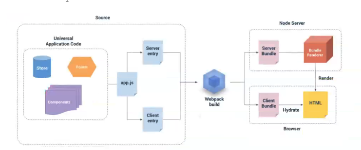

# Vue SSR 实战

<https://github.com/eddyerburgh/vue-cli-ssr-example>

## 安装依赖

`npm install vue-server-renderer express --save`

## 启动脚本

server/index.js

```js
const express = require('express');
const Vue = require('vue');

const app = express();
const renderer = require('vue-server-renderer').createRenderer();

// ⻚⾯
const page = new Vue({
  data: { name: '开课吧', count: 1 },
  template: `<div>
              <h1>{{name}}</h1>
              <h1>{{count}}</h1>
            </div> `,
});

app.get('/', async function(req, res) {
  try {
    // renderToString可以将vue实例转换为html字符串
    const html = await renderer.renderToString(page);
    res.send(html);
  } catch (error) {
    res.status(500).send('internal server error');
  }
});

app.listen(3000, () => {
  console.log('渲染服务端启动成功 at http://localhost:3000');
});
```

Access `localhost:3000` check element: `<div data-server-rendered="true">`.

## 构建步骤

webpack 根据执⾏环境⽣成 server bundle 和 client bundle



## 路由 Vue-router

单⻚应⽤的⻚⾯路由，都是前端控制，后端只负责提供数据 ⼀个简单的单⻚应⽤，使⽤ vue-router,为了⽅便前后端公⽤路由数据，我们新建 router.js 对外暴露 createRouter

`npm i vue-router -s`

```js
// router/index.js

import Vue from 'vue';
import Router from 'vue-router';

import Index from '@/components/Index';

Vue.use(Router);

// 导出工厂，因为服务端渲染要为不同用户的请求都创建新的 router，状态隔离。
export function createRouter() {
  return new Router({
    routes: [
      { path: '/', component: Index },
      { path: '/detail', component: () => import('@/components/Detail.vue') },
    ],
  });
}
```

```vue
// components/Detail.vue

<template>
  <div>
    Detail page
  </div>
</template>

<script>
export default {};
</script>

<style lang="scss" scoped></style>
```

```js
// components/Index.vue

<template>
  <div>
    Index page
  </div>
</template>

<script>
export default {};
</script>

<style lang="scss" scoped></style>
```

```html
// components/App.vue

<div id="app">
  

  <ul>
    <li><router-link to="/">Home</router-link></li>
    <li><router-link to="/detail">Detail</router-link></li>
  </ul>

  <router-view></router-view>
</div>
```

## csr 和 ssr 通用

Create app.js:

```js
// entry-server.js, entry-client.js both use this
import Vue from 'vue';
import App from './App.vue';
import { createRouter } from './router';

// 创建 Vue 实例
export function createApp(context) {
  const router = createRouter();
  const app = new Vue({ router, context, render: (h) => h(App) });
  return { app, router };
}
```

csr 的⼊⼝⽂件 entry-client.js

```js
import { createApp } from './app';

const { app, router } = createApp();
router.onReady(() => {
  app.$mount('#app');
});
```

ssr 的⼊⼝⽂件 entry-server.js

```js
import { createApp } from './app';

export default (context) => {
  // 我们返回⼀个 Promise
  // 确保路由或组件准备就绪
  return new Promise((resolve, reject) => {
    const { app, router } = createApp(context);
    // 跳转到⾸屏的地址
    router.push(context.url);
    router.onReady(() => {
      resolve(app);
    }, reject);
  });
};
```

后端加⼊ webpack

`npm install cross-env vue-server-renderer webpack-node-externals lodash.merge --save`

vue.config.js

```js
const VueSSRServerPlugin = require('vue-server-renderer/server-plugin');
const VueSSRClientPlugin = require('vue-server-renderer/client-plugin');
// 优化
const nodeExternals = require('webpack-node-externals');
const merge = require('lodash.merge');
// 根据 WEBPACK_TARGET 作相应输出
const TARGET_NODE = process.env.WEBPACK_TARGET === 'node';
const target = TARGET_NODE ? 'server' : 'client';

module.exports = {
  css: {
    extract: false,
  },
  outputDir: `./dist/${target}`,
  configureWebpack: () => ({
    // 将 entry 指向应⽤程序的 server / client ⽂件
    entry: `./src/entry-${target}.js`,
    // 对 bundle renderer 提供 source map ⽀持
    devtool: 'source-map',
    target: TARGET_NODE ? 'node' : 'web',
    node: TARGET_NODE ? undefined : false,
    output: {
      libraryTarget: TARGET_NODE ? 'commonjs2' : undefined,
    },
    // https://webpack.js.org/configuration/externals/#function
    // https://github.com/liady/webpack-node-externals
    // 外置化应⽤程序依赖模块。可以使服务器构建速度更快，
    // 并⽣成较⼩的 bundle ⽂件。
    externals: TARGET_NODE
      ? nodeExternals({
          // 不要外置化 webpack 需要处理的依赖模块。
          // 你可以在这⾥添加更多的⽂件类型。例如，未处理 *.vue 原始⽂件，
          // 你还应该将修改 `global`（例如 polyfill）的依赖模块列⼊⽩名单
          whitelist: [/\.css$/],
        })
      : undefined,
    optimization: {
      splitChunks: TARGET_NODE ? false : undefined,
    },
    plugins: [TARGET_NODE ? new VueSSRServerPlugin() : new VueSSRClientPlugin()],
  }),
  chainWebpack: (config) => {
    config.module
      .rule('vue')
      .use('vue-loader')
      .tap((options) => {
        merge(options, {
          optimizeSSR: false,
        });
      });
  },
};
```

服务器启动⽂件，server.js

```js
const fs = require('fs');
const express = require('express');
const app = express();

// 第 2 步：获得⼀个createBundleRenderer
const { createBundleRenderer } = require('vue-server-renderer');
const bundle = require('./dist/server/vue-ssr-server-bundle.json');
const clientManifest = require('./dist/client/vue-ssr-client-manifest.json');

const renderer = createBundleRenderer(bundle, {
  runInNewContext: false,
  template: fs.readFileSync('./src/index.temp.html', 'utf-8'),
  clientManifest: clientManifest,
});

function renderToString(context) {
  return new Promise((resolve, reject) => {
    renderer.renderToString(context, (err, html) => {
      resolve(html);
    });
  });
}

// 开放dist⽬录
app.use(express.static('./dist/client'));

app.get('*', async (req, res) => {
  console.log(req.url, 123);
  try {
    const context = { title: 'ssr test', url: req.url };
    const html = await renderToString(context);
    res.send(html);
  } catch (error) {
    res.status(500).send('internal server error');
  }
});

app.listen(3000, () => {
  console.log('渲染服务端启动成功 at http://localhost:3000');
});
```

宿主⽂件 src/index.temp.html

```html
<!DOCTYPE html>
<html lang="en">
  <head>
    <meta charset="utf-8" />
    <meta http-equiv="X-UA-Compatible" content="IE=edge" />
    <meta name="viewport" content="width=device-width,initial-scale=1.0" />
    <title>vue-ssr</title>
  </head>

  <body>
    <!--vue-ssr-outlet-->
  </body>
</html>
```

脚本配置 package.json

```
"build:client": "vue-cli-service build",
"build:server": "cross-env WEBPACK_TARGET=node vue-cli-service build -mode server",
"build": "npm run build:client && npm run build:server",
```

## 整合 Vuex

### 安装 vuex

`npm install --save vuex`

store/index.js

```js
import Vue from 'vue';
import Vuex from 'vuex';

Vue.use(Vuex);

export function createStore() {
  return new Vuex.Store({
    state: { count: 108 },
    mutations: {},
    actions: {},
  });
}
```

update app.js: 挂载 store

```diff
// entry-server.js, entry-client.js both use this
import Vue from 'vue';
import App from './App.vue';
import { createRouter } from './router';
+ import { createStore } from './store';

// 创建 Vue 实例
export function createApp(context) {
  const router = createRouter();
+  const store = createStore();
  const app = new Vue({
    router,
+    store,
    context,
    render: (h) => h(App)
  });
  return { app, router };
}
```

使⽤ src/components/index.vue: `<h2>num:{{$store.state.count}}</h2>`